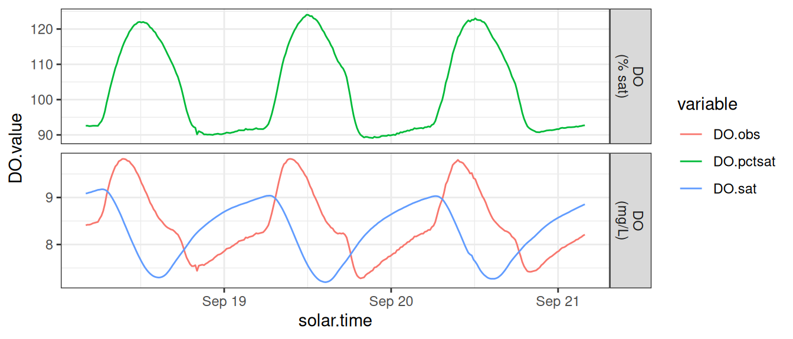
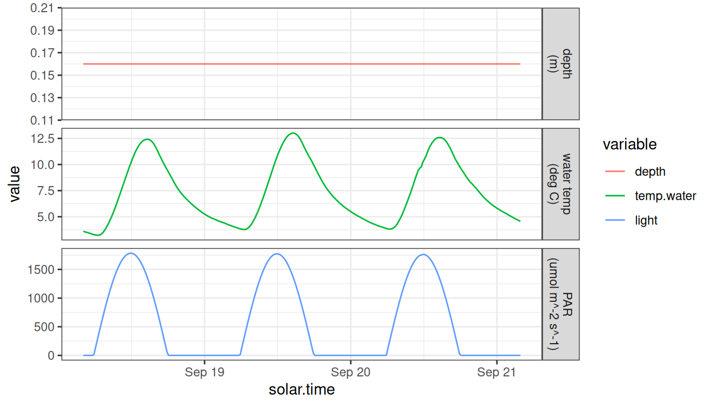

# Data Preparation

## Requirements

A properly formatted input dataset for streamMetabolizer models has:

- exactly the right data columns and column names. Call
  [`metab_inputs()`](https://connorb.github.io/streamMetabolizer/reference/metab_inputs.md)
  to see the requirements for a specific model type.
- data in the right units. See
  [`?mm_data`](https://connorb.github.io/streamMetabolizer/reference/mm_data.md)
  for definitions of each column.

An input dataset may optionally include:

- partial days; partial days will be automatically excluded, so you
  don’t need to do this yourself.
- non-continuous days; no current streamMetabolizer models require
  continuous days.

## Example

An example of a properly formatted input dataset is available in the
streamMetabolizer package - data are from French Creek in Laramie, WY,
courtesy of Bob Hall.

``` r

library(streamMetabolizer)
dat <- data_metab(num_days='3', res='15')
```

Inspect the dimensions and column names of the data.

``` r

dim(dat)
```

    [1] 288   6

``` r

dat[c(1,48,96,240,288),] # some example rows
```

                  solar.time DO.obs   DO.sat depth temp.water    light
    5689 2012-09-18 04:05:58   8.41 9.083329  0.16       3.60   0.0000
    5830 2012-09-18 15:50:58   8.36 7.403370  0.16      11.80 925.1370
    5974 2012-09-19 03:50:58   8.17 8.927566  0.16       4.25   0.0000
    6404 2012-09-20 15:50:58   8.35 7.358846  0.16      12.06 898.9231
    6548 2012-09-21 03:50:58   8.21 8.854844  0.16       4.56   0.0000

You can get additional information about the expected format of the data
in the
[`?metab`](https://connorb.github.io/streamMetabolizer/reference/metab.md)
help document. When preparing your own data, make sure the class and
units of your data match those specified in that document.

## Exploring input data

You can use other common R packages to graphically inspect the input
data. Look for outliers and oddities to ensure the quality of your data.

``` r

library(dplyr)
library(tidyr)
library(ggplot2)
```

``` r

dat %>% 
  mutate(DO.pctsat = 100 * (DO.obs / DO.sat)) %>%
  select(solar.time, starts_with('DO')) %>%
  gather(type, DO.value, starts_with('DO')) %>%
  mutate(units=ifelse(type == 'DO.pctsat', 'DO\n(% sat)', 'DO\n(mg/L)')) %>%
  ggplot(aes(x=solar.time, y=DO.value, color=type)) + geom_line() + 
  facet_grid(units ~ ., scale='free_y') + theme_bw() +
  scale_color_discrete('variable')
```



``` r

labels <- c(depth='depth\n(m)', temp.water='water temp\n(deg C)', light='PAR\n(umol m^-2 s^-1)')
dat %>% 
  select(solar.time, depth, temp.water, light) %>%
  gather(type, value, depth, temp.water, light) %>%
  mutate(
    type=ordered(type, levels=c('depth','temp.water','light')),
    units=ordered(labels[type], unname(labels))) %>%
  ggplot(aes(x=solar.time, y=value, color=type)) + geom_line() + 
  facet_grid(units ~ ., scale='free_y') + theme_bw() +
  scale_color_discrete('variable')
```



## Check the input data format

Your data need to have specific column names and units. To see what is
required, use the `metab_inputs` function to get a description of the
required inputs for a given model type. The output of metab_inputs is a
table describing the required column names, the classes and units of the
values in each column, and whether that column is required or optional.
The inputs are identical for the model types ‘mle’, ‘bayes’, and
‘night’, so here we’ll just print the requriements for ‘mle’.

``` r

metab_inputs('mle', 'data')
```

         colname          class units     need
    1 solar.time POSIXct,POSIXt  <NA> required
    2     DO.obs        numeric  <NA> required
    3     DO.sat        numeric  <NA> required
    4      depth        numeric  <NA> required
    5 temp.water        numeric  <NA> required
    6      light        numeric  <NA> required
    7  discharge        numeric  <NA> optional

Also read through the help pages at
[`?metab`](https://connorb.github.io/streamMetabolizer/reference/metab.md)
and
[`?mm_data`](https://connorb.github.io/streamMetabolizer/reference/mm_data.md)
for more detailed variable definitions and requirements.

## Prepare the timestamps

To prepare your timestamps for metabolism modeling, you need to convert
from the initial number or text format into POSIXct with the correct
timezone (tz), then to solar mean time.

### Step 1: POSIXct

Convert your logger-format data to POSIXct in a local timezone (with or
without daylight savings, as long as you have that timezone scheme
specified). Here are a few examples of specific scenarios and solutions.

#### Starting with numeric datetimes, e.g., from PMEs

If you have datetimes stored in seconds since 1/1/1970 at Greenwich
(i.e., in UTC):

``` r

num.time <- 1471867200
(posix.time.localtz <- as.POSIXct(num.time, origin='1970-01-01', tz='UTC'))
```

    [1] "2016-08-22 12:00:00 UTC"

If you have datetimes stored in seconds since 1/1/1970 at Laramie, WY
(i.e., in MST, no daylight savings):

``` r

num.time <- 1471867200
(posix.time.nominalUTC <- as.POSIXct(num.time, origin='1970-01-01', tz='UTC')) # the numbers get treated as UTC no matter what tz you request
```

    [1] "2016-08-22 12:00:00 UTC"

``` r

(posix.time.localtz <- lubridate::force_tz(posix.time.nominalUTC, 'Etc/GMT+7')) # +7 = mountain standard time
```

    [1] "2016-08-22 12:00:00 -07"

#### Starting with text timestamps

If you have datetimes stored as text timestamps in UTC, you can bypass
the conversion to local time and just start with UTC. Then rather than
using
[`calc_solar_time()`](https://connorb.github.io/streamMetabolizer/reference/calc_solar_time.md)
in Step 2, you’ll use
[`convert_UTC_to_solartime()`](https://connorb.github.io/streamMetabolizer/reference/convert_UTC_to_solartime.md).

``` r

text.time <- '2016-08-22 12:00:00'
(posix.time.utc <- as.POSIXct(text.time, tz='UTC'))
```

    [1] "2016-08-22 12:00:00 UTC"

If you have datetimes stored as text timestamps in EST/EDT (with
daylight savings):

``` r

text.time <- '2016-08-22 12:00:00'
(posix.time.localtz <- as.POSIXct(text.time, format="%Y-%m-%d %H:%M:%S", tz='America/New_York'))
```

    [1] "2016-08-22 12:00:00 EDT"

If you have datetimes stored as text timestamps in EST (no daylight
savings):

``` r

text.time <- '2016-08-22 12:00:00'
(posix.time.localtz <- as.POSIXct(text.time, format="%Y-%m-%d %H:%M:%S", tz='Etc/GMT+5'))
```

    [1] "2016-08-22 12:00:00 -05"

See https://en.wikipedia.org/wiki/List_of_tz_database_time_zones for a
list of timezone names.

#### Starting with `chron` datetimes

If you have datetimes stored in the `chron` time format in EST (no
daylight savings):

``` r

chron.time <- chron::chron('08/22/16', '12:00:00')
time.format <- "%Y-%m-%d %H:%M:%S"
text.time <- format(chron.time, time.format) # direct as.POSIXct time works poorly
(posix.time.localtz <- as.POSIXct(text.time, format=time.format, tz='Etc/GMT+5'))
```

    [1] "2016-08-22 12:00:00 -05"

### Step 2: Solar time

Now convert from local time to solar time. In `streamMetabolizer`
vocabulary, `solar.time` specifically means mean solar time, the kind
where every day is exactly 24 hours, in contrast to apparent solar time.
You’re ready for this step when you have the correct time in a local
timezone and `lubridate::tz(yourtime)` reflects the correct timezone.

``` r

lubridate::tz(posix.time.localtz) # yep, we want and have the code for EST
```

    [1] "Etc/GMT+5"

``` r

(posix.time.solar <- streamMetabolizer::calc_solar_time(posix.time.localtz, longitude=-106.3))
```

    [1] "2016-08-22 09:55:58 UTC"

## Other data preparation

streamMetabolizer offers many functions to help you prepare your data
for modeling. We recommend that you explore the help pages for the
following functions:

- `calc_depth`
- `calc_DO_sat`
- `calc_light`
- `convert_date_to_doyhr`
- `convert_localtime_to_UTC`
- `convert_UTC_to_solartime`
- `convert_k600_to_kGAS`
- `convert_PAR_to_SW`
