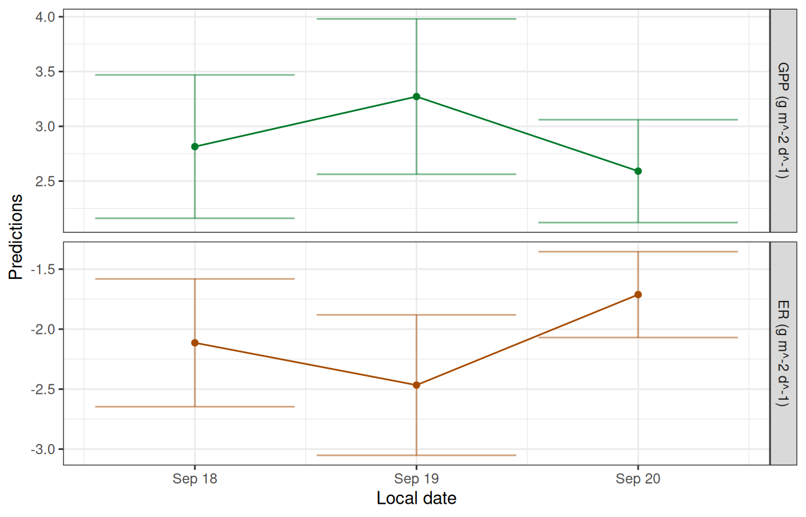
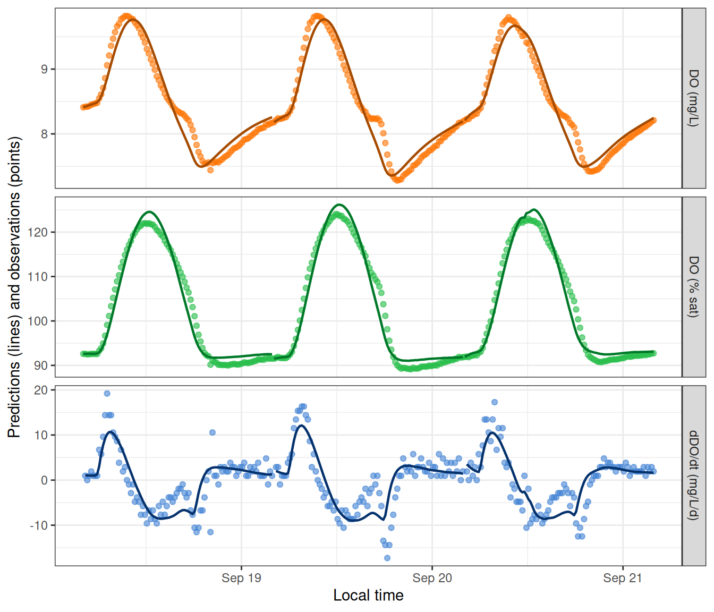

# MLE Models

This file provides an example of fitting an MLE (maximum likelihood
estimation) model, following the general outline in the
[Quickstart](https://connorb.github.io/streamMetabolizer/articles/get_started.md)
tutorial.

As a reminder, there are four steps to fitting a metabolism model in
`streamMetabolizer`.

1.  Prepare and inspect the input data.
2.  Choose a model configuration appropriate to your data.
3.  Fit the model.
4.  Inspect the output.

## Preliminaries

If you haven’t already installed the package, see the
[Installation](https://connorb.github.io/streamMetabolizer/articles/installation.md)
tutorial.

Next load the R libraries. Only `streamMetabolizer` is required to run
models, but we’ll also be using `dplyr` to inspect the results.

``` r

library(streamMetabolizer)
library(dplyr)
```

## 1. Preparing the input data

Load a small example dataset from the package (data are from French
Creek in Laramie, WY, courtesy of Bob Hall). We’ll use the
`streamMetabolizer` standard in defining our day to run from 4 am
(`day_start=4`) to 4 am (`day_end=28`).

``` r

dat <- data_metab(num_days='3', res='15', day_start=4, day_end=28)
```

## 2. Configuring the model

There are two steps to configuring a metabolism model in
`streamMetabolizer`.

1.  Identify the name of the model structure you want using
    [`mm_name()`](https://connorb.github.io/streamMetabolizer/reference/mm_name.md).
2.  Set the specifications for the model using defaults
    from[`specs()`](https://connorb.github.io/streamMetabolizer/reference/specs.md)
    as a starting point.

### 2a. Choose a model structure

Call `mm_name` to choose a specific MLE model name/structure. Here we
will fit the default MLE model. Many others are available (see [Model
Structures](https://connorb.github.io/streamMetabolizer/articles/model_structures.md)
and [GPP and ER
equations](https://connorb.github.io/streamMetabolizer/articles/gpp_er_eqs.md)),
but this one is common and fast.

``` r

mle_name <- mm_name(type='mle')
mle_name
```

    [1] "m_np_oi_tr_plrckm.nlm"

### 2b. Set the specifications

Having chosen a model, we next need to define a list of specifications
for that model. The `specs` function creates a list appropriate to the
model we chose.

``` r

mle_specs <- specs(mle_name)
mle_specs
```

    Model specifications:
      model_name        m_np_oi_tr_plrckm.nlm
      day_start         4
      day_end           28
      day_tests         full_day, even_timesteps, complete_data, pos_discharge, p...
      required_timestep NA
      init.GPP.daily    8
      init.ER.daily     -10
      init.K600.daily   10                                                          

See
[`?specs`](https://connorb.github.io/streamMetabolizer/reference/specs.md)
for definitions of all specifications. Note that most of the
specifications in that help file are omitted from the output of
`specs(mle_name)` above - this is because MLE models are simple and
don’t have many parameters to set. Any of those parameters that are
included in `mle_specs` can be modified, either by calling
[`specs()`](https://connorb.github.io/streamMetabolizer/reference/specs.md)
again or by replacing that value in the `mle_specs` list. Here is a
command that sets the the initial values of GPP, ER, and K600 for the
likelihood maximization. (I’ve done this just for illustration; the
model results aren’t affected by these particular changes for this
particular dataset, and you will seldom need to edit these values.)

``` r

mle_specs <- specs(mle_name, init.GPP.daily=2, init.ER.daily=-1, init.K600.daily=3)
```

## 3. Fitting the model

Now actually fit the model using the `metab` function.

``` r

mm <- metab(mle_specs, data=dat, info=c(site='French Creek, WY', source='Bob Hall'))
```

It’s optional, but sometimes helpful, to include some sort of metadata
in the `info`, as I’ve done above. I’ve chosen to put the metadata in a
character vector, but metadata can take any format you like.

### 4. Inspecting the model

Models show lots of relevant information if you simply print them at the
command line.

``` r

mm
```

    metab_model of type metab_mle
      User-supplied metadata:
                  site             source
    "French Creek, WY"         "Bob Hall"
    streamMetabolizer version 0.12.1.9000
    Specifications:
      model_name        m_np_oi_tr_plrckm.nlm
      day_start         4
      day_end           28
      day_tests         full_day, even_timesteps, complete_data, pos_discharge, p...
      required_timestep NA
      init.GPP.daily    2
      init.ER.daily     -1
      init.K600.daily   3
    Fitting time: 0.418 secs elapsed
    Parameters (3 dates):
            date GPP.daily GPP.daily.lower GPP.daily.upper   ER.daily
    1 2012-09-18 2.814768         2.160462        3.469074 -2.113856
    2 2012-09-19 3.271369         2.562593        3.980145 -2.466321
    3 2012-09-20 2.590855         2.121370        3.060339 -1.712003
      ER.daily.lower ER.daily.upper K600.daily K600.daily.lower K600.daily.upper
    1      -2.646427      -1.581284  31.05944          24.49084         37.62804
    2      -3.051683      -1.880959  33.23987          26.63806         39.84167
    3      -2.069836      -1.354171  28.71773          24.02289         33.41257
      msgs.fit
    1
    2
    3
    Predictions (3 dates):
    # A tibble: 3 × 9
      date         GPP GPP.lower GPP.upper    ER ER.lower ER.upper msgs.fit
      <date>     <dbl>     <dbl>     <dbl> <dbl>    <dbl>    <dbl> <chr>
    1 2012-09-18  2.81      2.16      3.47 -2.11    -2.65    -1.58 "       "
    2 2012-09-19  3.27      2.56      3.98 -2.47    -3.05    -1.88 "       "
    3 2012-09-20  2.59      2.12      3.06 -1.71    -2.07    -1.35 "       "
    # ℹ 1 more variable: msgs.pred <chr>

You can also extract specific pieces of information using designated
accessor functions. For example, the `info` and `data` are saved in the
fitted model object and can be pulled out with `get_info` and
`get_data`, respectively.

``` r

get_info(mm)
```

                  site             source
    "French Creek, WY"         "Bob Hall" 

``` r

head(get_data(mm))
```

    # A tibble: 6 × 8
      date       solar.time          DO.obs DO.sat depth temp.water light DO.mod
      <date>     <dttm>               <dbl>  <dbl> <dbl>      <dbl> <dbl>  <dbl>
    1 2012-09-18 2012-09-18 04:05:58   8.41   9.08  0.16       3.6      0   8.41
    2 2012-09-18 2012-09-18 04:20:58   8.42   9.09  0.16       3.56     0   8.42
    3 2012-09-18 2012-09-18 04:35:58   8.42   9.11  0.16       3.51     0   8.43
    4 2012-09-18 2012-09-18 04:50:58   8.43   9.11  0.16       3.48     0   8.44
    5 2012-09-18 2012-09-18 05:05:58   8.45   9.13  0.16       3.42     0   8.45
    6 2012-09-18 2012-09-18 05:20:58   8.46   9.14  0.16       3.38     0   8.46

We can also get information about the model fitting process.

``` r

get_fitting_time(mm) # the time it took to fit the model
```

       user  system elapsed
      0.416   0.003   0.418 

``` r

get_version(mm) # the streamMetabolizer version used to fit the model
```

    [1] "0.12.1.9000"

``` r

get_specs(mm) # the specifications we passed in
```

    Model specifications:
      model_name        m_np_oi_tr_plrckm.nlm
      day_start         4
      day_end           28
      day_tests         full_day, even_timesteps, complete_data, pos_discharge, p...
      required_timestep NA
      init.GPP.daily    2
      init.ER.daily     -1
      init.K600.daily   3                                                           

There is a function to plot the daily metabolism estimates.

``` r

plot_metab_preds(mm)
```



There is also a function to plot the dissolved oxygen predictions
(lines) along with the original observations (points).

``` r

plot_DO_preds(mm)
```



You can output the daily and instantaneous predictions to data.frames
for further inspection.

``` r

predict_metab(mm)
```

    # A tibble: 3 × 10
      date         GPP GPP.lower GPP.upper    ER ER.lower ER.upper msgs.fit warnings
      <date>     <dbl>     <dbl>     <dbl> <dbl>    <dbl>    <dbl> <chr>    <chr>
    1 2012-09-18  2.81      2.16      3.47 -2.11    -2.65    -1.58 "      … ""
    2 2012-09-19  3.27      2.56      3.98 -2.47    -3.05    -1.88 "      … ""
    3 2012-09-20  2.59      2.12      3.06 -1.71    -2.07    -1.35 "      … ""
    # ℹ 1 more variable: errors <chr>

``` r

head(predict_DO(mm))
```

    # A tibble: 6 × 8
      date       solar.time          DO.obs DO.sat depth temp.water light DO.mod
      <date>     <dttm>               <dbl>  <dbl> <dbl>      <dbl> <dbl>  <dbl>
    1 2012-09-18 2012-09-18 04:05:58   8.41   9.08  0.16       3.6      0   8.41
    2 2012-09-18 2012-09-18 04:20:58   8.42   9.09  0.16       3.56     0   8.42
    3 2012-09-18 2012-09-18 04:35:58   8.42   9.11  0.16       3.51     0   8.43
    4 2012-09-18 2012-09-18 04:50:58   8.43   9.11  0.16       3.48     0   8.44
    5 2012-09-18 2012-09-18 05:05:58   8.45   9.13  0.16       3.42     0   8.45
    6 2012-09-18 2012-09-18 05:20:58   8.46   9.14  0.16       3.38     0   8.46
