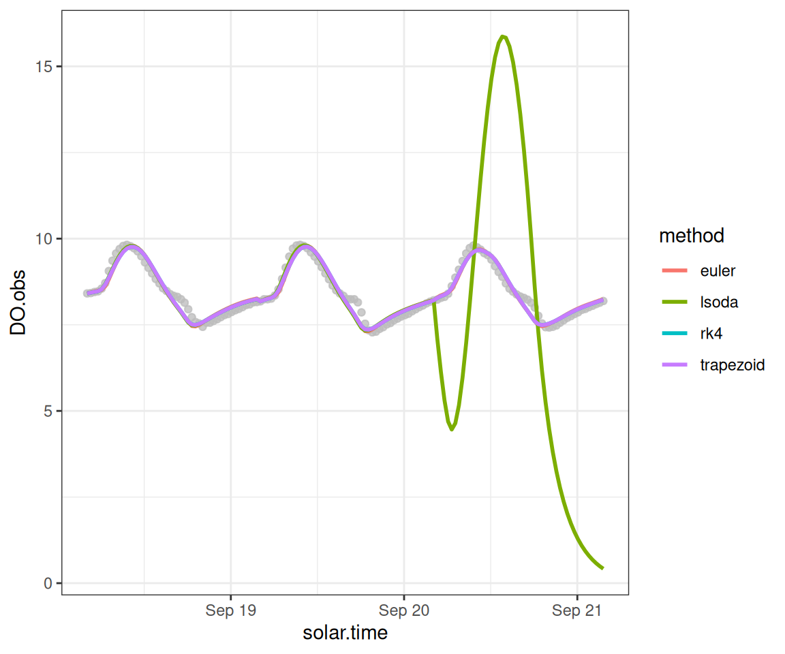
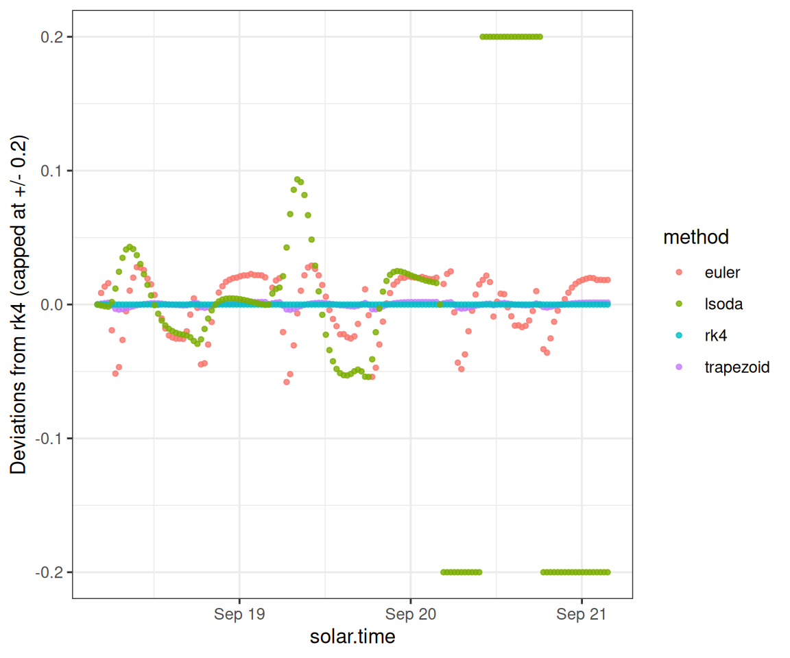

# ODE Methods

## Overview

This vignette demonstrates how you can choose and compare the ODE
solution method, which is the numerical algorithm used to translate from
a given set of daily metabolism parameters into a time series of
dissolved oxygen predictions.

## Setup

Load streamMetabolizer and some helper packages.

``` r

library(streamMetabolizer)
library(dplyr)
library(ggplot2)
```

Get some data to work with: here we’re requesting three days of data at
30-minute resolution. Thanks to Bob Hall for the test data.

``` r

dat <- data_metab('3','30')
```

## Numerical integration

Inspired by Song et al. 2016, we can now do several types of numerical
integration and compare them. `lsoda` often fails to converge, but `rk4`
and `trapezoid` perform well and very similarly to one another (and
`trapezoid` is faster). `trapezoid` is available for both MLE and
Bayesian models.

Here we fit MLE models using four different ODE methods.

``` r

mm_euler <- metab(specs(mm_name('mle', ode_method='euler')), dat)
```

``` r

mm_trapezoid <- metab(specs(mm_name('mle', ode_method='trapezoid')), dat)
```

``` r

mm_rk4 <- metab(specs(mm_name('mle', ode_method='rk4')), dat)
```

``` r

mm_lsoda <- metab(specs(mm_name('mle', ode_method='lsoda')), dat)
```

    Warning: we've seen bad results with ODE methods 'lsoda', 'lsodes', and 'lsodar'. Use at your own
    risk

    DLSODA-  At T (=R1), too much accuracy requested
          for precision of machine..  See TOLSF (=R2)
    In above message, R1 = 27.3718, R2 = nan
     

Now we create a data.frame to compare the above options.

``` r

DO.standard <- rep(predict_DO(mm_rk4)$'DO.mod', times=4)
ode_preds <- bind_rows(
  mutate(predict_DO(mm_euler), method='euler'),
  mutate(predict_DO(mm_trapezoid), method='trapezoid'),
  mutate(predict_DO(mm_rk4), method='rk4'),
  mutate(predict_DO(mm_lsoda), method='lsoda')) %>%
  mutate(DO.mod.diffeuler = DO.mod - DO.standard)
```

We can plot the predictions from each method.

``` r

ggplot(ode_preds, aes(x=solar.time)) +
  geom_point(aes(y=DO.obs), color='grey', alpha=0.3) +
  geom_line(aes(y=DO.mod, color=method), size=1) +
  theme_bw()
```

    Warning: Using `size` aesthetic for lines was deprecated in ggplot2 3.4.0.
    ℹ Please use `linewidth` instead.



To inspect the details, we can also plot the predictions as deviations
from the rk4 method.

``` r

ggplot(ode_preds, aes(x=solar.time)) +
  geom_point(aes(y=pmax(-0.2, pmin(0.2, DO.mod.diffeuler)), color=method), size=1, alpha=0.8) +
  scale_y_continuous(limits=c(-0.2,0.2)) +
  ylab("Deviations from rk4 (capped at +/- 0.2)") +
  theme_bw()
```


