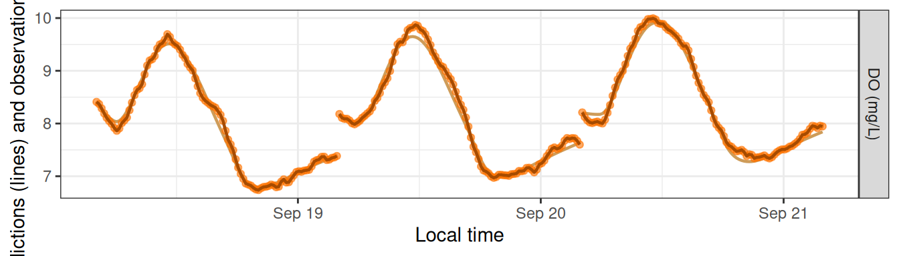
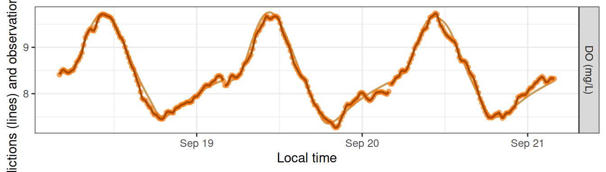
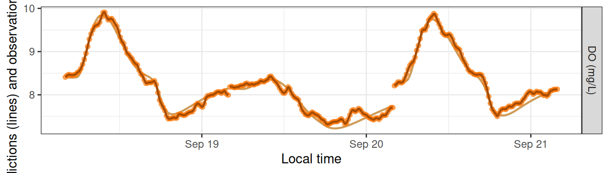
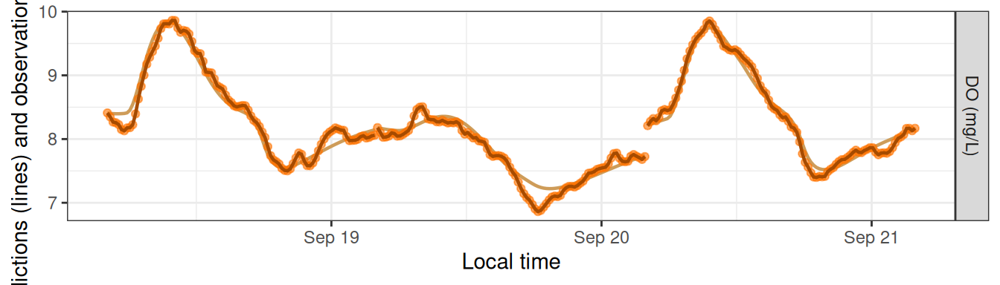
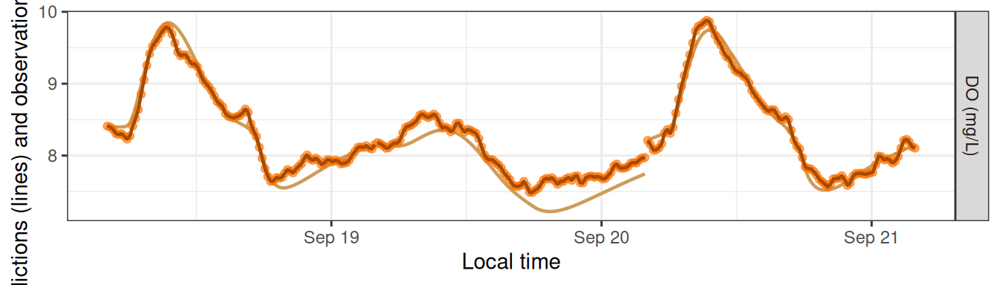
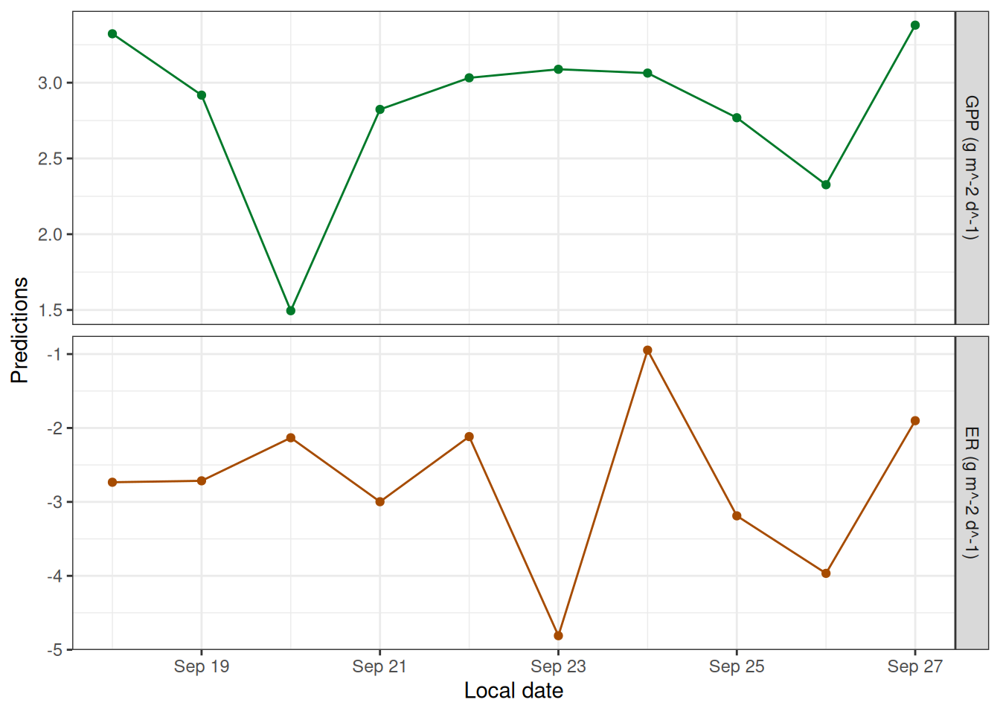
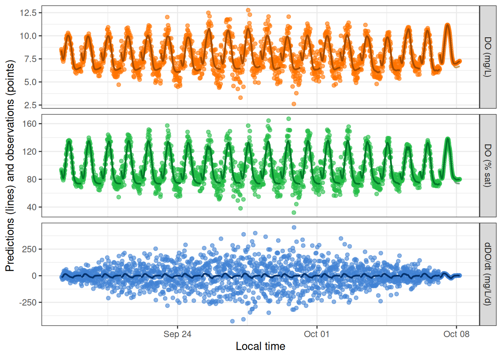
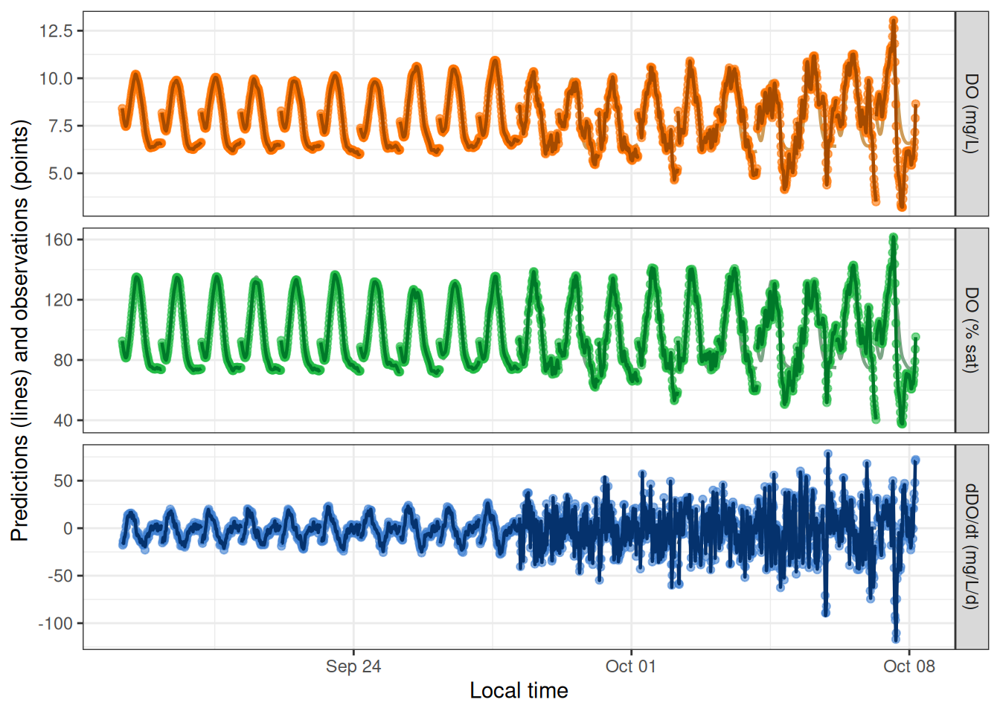
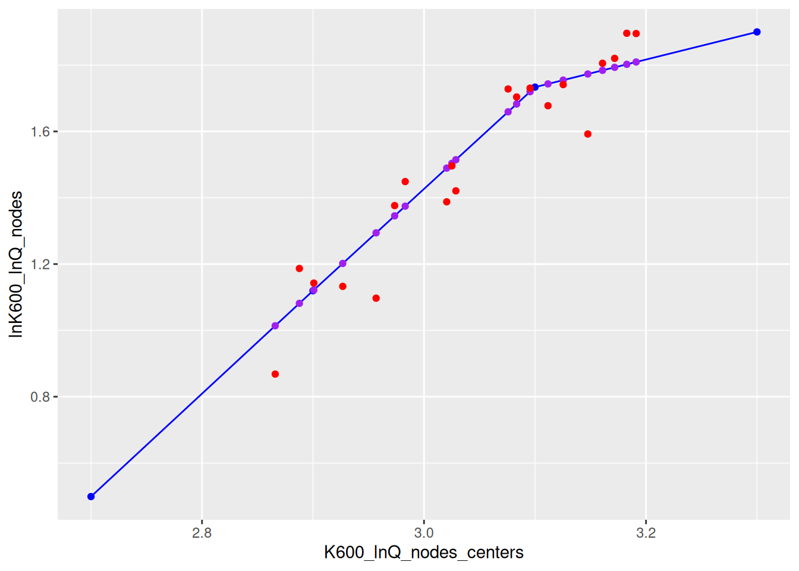

# Simulations

## Overview

This vignette shows how to simulate dissolved oxygen ‘observations’ for
the purpose of exploring and testing metabolism models.

## Setup

Load streamMetabolizer and some helper packages.

``` r

library(streamMetabolizer)
library(dplyr)
library(ggplot2)
```

Get some data to work with: here we’re requesting three days of data at
15-minute resolution. Thanks to Bob Hall for the test data.

``` r

dat <- data_metab('3', '15')
```

## Creating a Sim Model

To create a simulation model, you should

1.  Choose a model structure
2.  Choose daily metabolism parameters
3.  Choose the other model specifications
4.  Create the model
5.  Generate predictions (simulations) from the model

### 1. Choosing the model structure

You can simulate data using any of the GPP and ER functions available to
MLE models. Simulations are done by models of type `'sim'` but otherwise
take very similar arguments to those of an MLE model. Here we’ll use a
model where ER is a function of temperature.

``` r

name_sim_q10 <- mm_name('sim', ER_fun='q10temp')
```

### 2. Choosing the daily parameters

To simulate data, you need to specify the daily parameters beforehand.
The model structure determines which parameters are needed. There are
three good ways to learn which daily parameters you need to specify.

#### A. Trial and error

To learn about parameter needs by trial and error, simply create the
model with the equations you want but without daily inputs, ask for the
parameters, and read the error message to get a list of parameters. It’s
fine to use the defaults for the specifications for now.

``` r

mm_sim_q10_trial <- metab(specs(name_sim_q10), dat)
get_params(mm_sim_q10_trial)
```

            date K600.daily GPP.daily      ER20 err.obs.sigma err.obs.phi err.proc.sigma err.proc.phi
    1 2012-09-18   2.369627  6.125648 -10.58618          0.01           0            0.2            0
    2 2012-09-19   3.459990 10.641104 -16.39555          0.01           0            0.2            0
    3 2012-09-20   7.539516  9.822649 -10.07421          0.01           0            0.2            0
      discharge.daily
    1        21.63259
    2        21.00094
    3        20.35464

Great: we need `GPP.daily`, `ER20`, and `K600.daily`. Now we can pick
values for those parameters and put them in a data.frame.

``` r

params_sim_q10a <- data.frame(date=as.Date(paste0('2012-09-',18:20)), GPP.daily=2.1, ER20=-5:-3, K600.daily=16)
params_sim_q10a
```

            date GPP.daily ER20 K600.daily
    1 2012-09-18       2.1   -5         16
    2 2012-09-19       2.1   -4         16
    3 2012-09-20       2.1   -3         16

#### B. Generate parameters from another model

You can also use fitted parameters from another model as your input for
a simulation model. This method could be useful for identifying
realistic parameters and/or exploring why a model fitting process didn’t
work so well.

First fit an MLE model to the same data using the `GPP_fun` and `ER_fun`
you want. It’s fine (again) to use the defaults for the specifications.

``` r

mm_mle_q10 <- metab(specs(mm_name('mle', ER_fun='q10temp')), data=dat)
```

Then ask for the parameters in the right format (without columns for
uncertainty or messages).

``` r

params_sim_q10b <- get_params(mm_mle_q10, uncertainty='none', messages=FALSE)
params_sim_q10b
```

            date GPP.daily      ER20 K600.daily
    1 2012-09-18  2.051333 -2.696135   22.36965
    2 2012-09-19  2.436224 -3.147503   24.27164
    3 2012-09-20  2.090918 -2.370546   22.84253

#### C. Look at `?mm_name`

Try it. We put lots of details in the help file. Check out the
documentation for the `GPP_fun` and `ER_fun` args in particular.

``` r

?mm_name
```

After reading the documentation you’ll create a data.frame of the same
format as in options A or B.

### 3. Choosing the specifications

After choosing parameters, the next step is to choose the rest of the
specifications. The main difference between sim models and other models
is that you can choose values for the probability distributions of the
observation and/or process errors. See
[`?specs`](https://connorb.github.io/streamMetabolizer/reference/specs.md)
for details on the distribution parameters `err_obs_sigma`,
`err_obs_phi`, `err_proc_sigma`, and `err_proc_phi`.

``` r

specs_sim_q10 <- specs(name_sim_q10, err_obs_sigma=0, err_proc_sigma=1, K600_daily=NULL, GPP_daily=NULL, ER20=NULL)
specs_sim_q10
```

    Model specifications:
      model_name        s_np_oipcpi_tr_plrqkm.rnorm
      day_start         4
      day_end           28
      day_tests         full_day, even_timesteps, complete_data, pos_discharge, pos_depth
      required_timestep NA
      discharge_daily   function; see element [['discharge_daily']] for details
      DO_mod_1          NULL
      K600_daily        NULL
      GPP_daily         NULL
      ER20              NULL
      err_obs_sigma     0
      err_obs_phi       0
      err_proc_sigma    1
      err_proc_phi      0
      err_round         NA
      sim_seed          NA                                                               

### 4. Creating a model

Now you can create a simulation model much as you would an MLE or
Bayesian model. We’ll make two models here, one for each of the
parameter sets we created above.

``` r

mm_sim_q10a <- metab(specs_sim_q10, dat, data_daily=params_sim_q10a)
mm_sim_q10b <- metab(specs_sim_q10, dat, data_daily=params_sim_q10b)
```

### 5. Generating predictions

Predictions and simulations are one and the same when your model is of
type `sim`. The output of `predict_DO` for `sim` models includes three
DO concentration columns. `DO.pure` is what the DO concentrations would
be if the GPP, ER, and K600 parameters exactly described what occurred
in the stream. If there’s process error in your model, `DO.mod` will
differ from `DO.pure` in that `DO.mod` also contains the process error
as a fourth driver (on top of GPP, ER, and reaeration) of in-situ DO
concentrations. (`DO.mod` and `DO.pure` are identical if there’s no
process error.) Lastly, `DO.obs` is a simulation of what your sensor
might record; it includes everything in `DO.mod` plus observation error
representing inaccuracies in how the sensor reads or records the DO
concentration. These three variables are plotted as a muted-color line
(`DO.pure`), a bold dark line (`DO.mod`), and brightly colored points
(`DO.obs`). `DO.pure` is mostly hidden behind the others unless the
errors are large.

``` r

head(predict_DO(mm_sim_q10a))
```

               date          solar.time   DO.sat depth temp.water light  DO.pure   DO.mod   DO.obs
    5689 2012-09-18 2012-09-18 04:05:58 9.083329  0.16       3.60     0 8.410000 8.410000 8.410000
    5692 2012-09-18 2012-09-18 04:20:58 9.093063  0.16       3.56     0 8.333532 8.397179 8.397179
    5695 2012-09-18 2012-09-18 04:35:58 9.105254  0.16       3.51     0 8.266667 8.388477 8.388477
    5698 2012-09-18 2012-09-18 04:50:58 9.112582  0.16       3.48     0 8.208204 8.366473 8.366473
    5701 2012-09-18 2012-09-18 05:05:58 9.127267  0.16       3.42     0 8.157374 8.320777 8.320777
    5704 2012-09-18 2012-09-18 05:20:58 9.137079  0.16       3.38     0 8.113493 8.311542 8.311542

``` r

head(predict_DO(mm_sim_q10b))
```

               date          solar.time   DO.sat depth temp.water light  DO.pure   DO.mod   DO.obs
    5689 2012-09-18 2012-09-18 04:05:58 9.083329  0.16       3.60     0 8.410000 8.410000 8.410000
    5692 2012-09-18 2012-09-18 04:20:58 9.093063  0.16       3.56     0 8.431047 8.431650 8.431650
    5695 2012-09-18 2012-09-18 04:35:58 9.105254  0.16       3.51     0 8.450642 8.455202 8.455202
    5698 2012-09-18 2012-09-18 04:50:58 9.112582  0.16       3.48     0 8.468822 8.509457 8.509457
    5701 2012-09-18 2012-09-18 05:05:58 9.127267  0.16       3.42     0 8.485984 8.608362 8.608362
    5704 2012-09-18 2012-09-18 05:20:58 9.137079  0.16       3.38     0 8.502466 8.592185 8.592185

``` r

plot_DO_preds(mm_sim_q10a, y_var='conc')
```



``` r

plot_DO_preds(mm_sim_q10b, y_var='conc')
```



## Simulating Errors

The main purpose of simulation models is to generate DO ‘observations’
with error, i.e., noise, to see whether other models can recover the
underlying parameters despite the noise.

For this section we’ll use a simulation with GPP as a saturating
function of light. We’ll use method B from above to choose our daily
parameters.

``` r

specs_sim_sat <- specs(mm_name('sim', GPP_fun='satlight'), err_obs_sigma=0, err_proc_sigma=1, K600_daily=NULL, Pmax=NULL, alpha=NULL, ER_daily=NULL)
params_sim_sat <- get_params(metab(specs(mm_name('mle', GPP_fun='satlight')), data=dat), uncertainty='none', messages=FALSE)
```

### Innovative errors

By default, simulations generate new noise each time you request
predictions.

``` r

mm_sim_sat_i <- metab(specs_sim_sat, dat, data_daily=params_sim_sat)
plot_DO_preds(mm_sim_sat_i, y_var='conc')
```



``` r

plot_DO_preds(mm_sim_sat_i, y_var='conc')
```



### Fixed errors

Alternatively, you can revise the value of `sim_seed` to be a number
(any number) and then the simulation produces the same noise each time.

``` r

mm_sim_sat_f <- metab(revise(specs_sim_sat, sim_seed=47), dat, data_daily=params_sim_sat)
plot_DO_preds(mm_sim_sat_f, y_var='conc')
```



``` r

plot_DO_preds(mm_sim_sat_f, y_var='conc')
```


## Inspecting Models

We’ll use a slightly longer dataset here to demonstrate the potential
for random noise at the levels of both the observations (every time you
run
[`predict_DO()`](https://connorb.github.io/streamMetabolizer/reference/predict_DO.md))
and the daily parameters (every time you define `data_daily`).

``` r

dat <- data_metab('10', '30')
params <- data.frame(date=as.Date(paste0('2012-09-',18:27)), Pmax=rnorm(10, 6, 2), alpha=rnorm(10, 0.01, 0.001), ER20=rnorm(10, -4, 2), K600.daily=16)
specs <- specs(mm_name('sim', GPP_fun='satlight', ER_fun='q10temp'), err_obs_sigma=0.2, err_proc_sigma=1, K600_daily=NULL, Pmax=NULL, alpha=NULL, ER20=NULL)
mm <- metab(specs, data=dat, data_daily=params)
```

Sim models print out their parameters with asterisks to denote that the
values are fixed rather than fitted.

``` r

mm
```

    metab_model of type metab_sim
    streamMetabolizer version 0.12.1.9000
    Specifications:
      model_name        s_np_oipcpi_tr_psrqkm.rnorm
      day_start         4
      day_end           28
      day_tests         full_day, even_timesteps, complete_data, pos_discharge, pos_depth
      required_timestep NA
      discharge_daily   function; see element [['discharge_daily']] for details
      DO_mod_1          NULL
      K600_daily        NULL
      Pmax              NULL
      alpha             NULL
      ER20              NULL
      err_obs_sigma     0.2
      err_obs_phi       0
      err_proc_sigma    1
      err_proc_phi      0
      err_round         NA
      sim_seed          NA
    Fitting time: 0.004 secs elapsed
    Parameters (10 dates)(* = fixed value):
             date K600.daily      Pmax        alpha       ER20 err.obs.sigma err.obs.phi err.proc.sigma
    1  2012-09-18        16* 8.499653* 0.010029735* -4.780125*          0.2           0              1
    2  2012-09-19        16* 7.007731* 0.010537178* -4.657027*          0.2           0              1
    3  2012-09-20        16* 3.238979* 0.009774623* -3.654986*          0.2           0              1
    4  2012-09-21        16* 6.647592* 0.011448446* -5.116775*          0.2           0              1
    5  2012-09-22        16* 7.267074* 0.011769600* -3.637974*          0.2           0              1
    6  2012-09-23        16* 7.610239* 0.011205473* -8.047155*          0.2           0              1
    7  2012-09-24        16* 8.687355* 0.008570020* -1.581533*          0.2           0              1
    8  2012-09-25        16* 6.872180* 0.010270915* -5.840345*          0.2           0              1
    9  2012-09-26        16* 5.671489* 0.009372155* -7.103388*          0.2           0              1
    10 2012-09-27        16* 8.824851* 0.011480065* -3.531540*          0.2           0              1
       err.proc.phi discharge.daily msgs.fit
    1            0        17.79254        NA
    2            0        16.10669        NA
    3            0        21.44621        NA
    4            0        21.75609        NA
    5            0        22.93774        NA
    6            0        17.55341        NA
    7            0        13.36296        NA
    8            0        15.64071        NA
    9            0        20.09371        NA
    10           0        18.76771        NA
    Predictions (10 dates):
             date      GPP GPP.lower GPP.upper        ER ER.lower ER.upper msgs.fit msgs.pred
    1  2012-09-18 3.322718        NA        NA -2.733984       NA       NA       NA
    2  2012-09-19 2.917873        NA        NA -2.714620       NA       NA       NA
    3  2012-09-20 1.495126        NA        NA -2.132107       NA       NA       NA
    4  2012-09-21 2.823602        NA        NA -2.997445       NA       NA       NA
    5  2012-09-22 3.032138        NA        NA -2.116472       NA       NA       NA
    6  2012-09-23 3.088538        NA        NA -4.810156       NA       NA       NA
    7  2012-09-24 3.063456        NA        NA -0.946805       NA       NA       NA
    8  2012-09-25 2.768727        NA        NA -3.188522       NA       NA       NA
    9  2012-09-26 2.326526        NA        NA -3.966624       NA       NA       NA
    10 2012-09-27 3.379752        NA        NA -1.901252       NA       NA       NA          

Sim models produce daily estimates of GPP and ER, which should help in
choosing simulation parameters. The GPP and ER predictions have no error
bars because they’re direct calculations from the daily parameters.

``` r

plot_metab_preds(mm)
```



## Multi-Day Simulations

You can also use `sim` models to simulate variation across many days.
Let’s start by generating a 60-day timeseries of water temperature,
DO.sat, etc. by concatenating 6 copies of 10 days of French Creek data:

``` r

dat <- data_metab('10','15')
datlen <- as.numeric(diff(range(dat$solar.time)) + as.difftime(15, units='mins'), units='days')
dat20 <- bind_rows(lapply((0:1)*10, function(add) {
  mutate(dat, solar.time = solar.time + as.difftime(add, units='days'))
}))
```

You can specify a distribution rather than specific values for GPP, ER,
and/or K600 parameters. In fact, this is the default if you don’t
specify daily data:

``` r

sp <- specs(mm_name('sim'))
lapply(unclass(sp)[c('K600_daily','GPP_daily','ER_daily')], function(fun) {
  list(code=attr(fun, 'srcref'), example_vals=fun(n=10))
})
```

    $K600_daily
    $K600_daily$code
    NULL

    $K600_daily$example_vals
     [1] 0.000000 3.041667 1.691562 0.000000 0.000000 9.150269 0.000000 0.000000 1.963738 0.000000


    $GPP_daily
    $GPP_daily$code
    NULL

    $GPP_daily$example_vals
     [1]  6.3938480  0.0000000  9.2218502  7.9300931  6.6799193  8.7033996 12.6205992  9.3363012
     [9]  0.6248416  5.3120436


    $ER_daily
    $ER_daily$code
    NULL

    $ER_daily$example_vals
     [1]  -7.306386 -13.664022 -11.323328 -11.504622 -12.452525  -9.600009   0.000000 -10.287064
     [9]  -6.434215  -5.875734

These functions get called to generate new values for K600.daily,
GPP.daily, and ER.daily each time you call `get_params`,
`predict_metab`, or `predict_DO`. (They’ll be the same random values
each time if you set `sim_seed`.)

``` r

mm <- metab(sp, dat20, data_daily=NULL)
get_params(mm)[c('date','K600.daily','GPP.daily','ER.daily')]
```

             date K600.daily GPP.daily   ER.daily
    1  2012-09-18 9.37479700  7.004708  -8.034752
    2  2012-09-19 0.00000000  7.873397  -9.770676
    3  2012-09-20 0.00000000  0.000000  -3.495911
    4  2012-09-21 2.12558917 10.086930  -9.674233
    5  2012-09-22 6.56054243 13.777194 -10.170129
    6  2012-09-23 0.00000000  7.394595 -15.856747
    7  2012-09-24 0.00000000 10.197761  -9.918282
    8  2012-09-25 2.91856376  3.129422  -8.915575
    9  2012-09-26 3.45033343  1.840689 -14.885647
    10 2012-09-27 0.75135036  8.496129  -4.045305
    11 2012-09-28 0.00000000  5.454635 -11.152586
    12 2012-09-29 0.06535163  5.387744  -8.064901
    13 2012-09-30 2.19358345  5.536649  -3.406265
    14 2012-10-01 7.14682974  6.711730  -4.533009
    15 2012-10-02 5.73843427  5.231803  -6.905055
    16 2012-10-03 0.00000000  7.278945  -8.832919
    17 2012-10-04 8.12514393 11.699391 -20.347704
    18 2012-10-05 7.11089460 13.397185  -9.931183
    19 2012-10-06 5.41556229 14.187898  -5.685988
    20 2012-10-07 3.16568780  2.076873  -4.953796

You can also set `err_obs_sigma` and other error terms as daily values
and/or functions. The defaults are simple numeric values that get
replicated to every date, but the values can also be vectors or
functions, as with `GPP_daily`, etc.

``` r

sp <- specs('sim', err_obs_sigma=function(n, ...) -0.01*((1:n) - (n/2))^2 + 1, err_proc_sigma=function(n, ...) rnorm(n, 0.1, 0.005), err_proc_phi=seq(0, 1, length.out=20), GPP_daily=3, ER_daily=-4, K600_daily=16)
mm <- metab(sp, dat20)
get_params(mm)
```

             date K600.daily GPP.daily ER.daily err.obs.sigma err.obs.phi err.proc.sigma err.proc.phi
    1  2012-09-18         16         3       -4          0.19           0     0.10018435   0.00000000
    2  2012-09-19         16         3       -4          0.36           0     0.10302125   0.05263158
    3  2012-09-20         16         3       -4          0.51           0     0.10251243   0.10526316
    4  2012-09-21         16         3       -4          0.64           0     0.10244948   0.15789474
    5  2012-09-22         16         3       -4          0.75           0     0.11156596   0.21052632
    6  2012-09-23         16         3       -4          0.84           0     0.09224674   0.26315789
    7  2012-09-24         16         3       -4          0.91           0     0.10277026   0.31578947
    8  2012-09-25         16         3       -4          0.96           0     0.10366869   0.36842105
    9  2012-09-26         16         3       -4          0.99           0     0.09983651   0.42105263
    10 2012-09-27         16         3       -4          1.00           0     0.09445635   0.47368421
    11 2012-09-28         16         3       -4          0.99           0     0.10708926   0.52631579
    12 2012-09-29         16         3       -4          0.96           0     0.10932443   0.57894737
    13 2012-09-30         16         3       -4          0.91           0     0.10089557   0.63157895
    14 2012-10-01         16         3       -4          0.84           0     0.09651036   0.68421053
    15 2012-10-02         16         3       -4          0.75           0     0.10285493   0.73684211
    16 2012-10-03         16         3       -4          0.64           0     0.10126910   0.78947368
    17 2012-10-04         16         3       -4          0.51           0     0.10079247   0.84210526
    18 2012-10-05         16         3       -4          0.36           0     0.10074757   0.89473684
    19 2012-10-06         16         3       -4          0.19           0     0.10241072   0.94736842
    20 2012-10-07         16         3       -4          0.00           0     0.09732948   1.00000000
       discharge.daily
    1         25.39595
    2         21.68066
    3         24.43856
    4         22.50270
    5         19.78738
    6         13.37400
    7         20.12811
    8         24.49518
    9         18.02193
    10        19.99025
    11        22.08034
    12        21.82257
    13        19.40496
    14        24.09994
    15        21.26624
    16        23.46473
    17        18.67673
    18        24.52940
    19        25.42341
    20        20.51211

``` r

plot_DO_preds(mm)
```



The above simulation emphasized day-to-day variation in `err_obs_sigma`.
Here’s a simulation emphasizing variation in `err_proc_sigma` and
`err_proc_phi`:

``` r

sp <- specs('sim', err_obs_sigma=0.01, err_proc_sigma=function(n, ...) rep(c(0.5, 4), each=10), err_proc_phi=rep(seq(0, 0.8, length.out=10), times=2), GPP_daily=3, ER_daily=-4, K600_daily=16)
mm <- metab(sp, dat20)
get_params(mm)
```

             date K600.daily GPP.daily ER.daily err.obs.sigma err.obs.phi err.proc.sigma err.proc.phi
    1  2012-09-18         16         3       -4          0.01           0            0.5   0.00000000
    2  2012-09-19         16         3       -4          0.01           0            0.5   0.08888889
    3  2012-09-20         16         3       -4          0.01           0            0.5   0.17777778
    4  2012-09-21         16         3       -4          0.01           0            0.5   0.26666667
    5  2012-09-22         16         3       -4          0.01           0            0.5   0.35555556
    6  2012-09-23         16         3       -4          0.01           0            0.5   0.44444444
    7  2012-09-24         16         3       -4          0.01           0            0.5   0.53333333
    8  2012-09-25         16         3       -4          0.01           0            0.5   0.62222222
    9  2012-09-26         16         3       -4          0.01           0            0.5   0.71111111
    10 2012-09-27         16         3       -4          0.01           0            0.5   0.80000000
    11 2012-09-28         16         3       -4          0.01           0            4.0   0.00000000
    12 2012-09-29         16         3       -4          0.01           0            4.0   0.08888889
    13 2012-09-30         16         3       -4          0.01           0            4.0   0.17777778
    14 2012-10-01         16         3       -4          0.01           0            4.0   0.26666667
    15 2012-10-02         16         3       -4          0.01           0            4.0   0.35555556
    16 2012-10-03         16         3       -4          0.01           0            4.0   0.44444444
    17 2012-10-04         16         3       -4          0.01           0            4.0   0.53333333
    18 2012-10-05         16         3       -4          0.01           0            4.0   0.62222222
    19 2012-10-06         16         3       -4          0.01           0            4.0   0.71111111
    20 2012-10-07         16         3       -4          0.01           0            4.0   0.80000000
       discharge.daily
    1         15.47326
    2         15.29103
    3         18.09729
    4         20.33013
    5         24.40749
    6         19.29048
    7         22.49132
    8         20.79165
    9         19.69817
    10        19.02042
    11        22.52500
    12        22.92043
    13        16.54689
    14        20.01916
    15        19.42305
    16        19.01034
    17        20.01367
    18        22.24611
    19        17.11139
    20        20.61862

``` r

plot_DO_preds(mm)
```



The daily parameter functions that you assign in
[`specs()`](https://connorb.github.io/streamMetabolizer/reference/specs.md)
can refer to previous daily parameters in the list. For example,
ER_daily can be a function of `GPP.daily`. Values of `GPP.daily` may
have been specified in the `GPP.daily` column of `data_daily` or in the
`GPP_daily` argument to
[`specs()`](https://connorb.github.io/streamMetabolizer/reference/specs.md);
the ER function should refer to it with its period-separated name,
`GPP.daily`.

``` r

sp <- specs('sim', err_obs_sigma=0.01, err_proc_sigma=0.4, K600_daily=16, GPP_daily=function(n, ...) round(rnorm(n, 4, 1), 1), ER_daily=function(GPP.daily, ...) GPP.daily*-2)
mm <- metab(sp, dat20)
get_params(mm)
```

             date K600.daily GPP.daily ER.daily err.obs.sigma err.obs.phi err.proc.sigma err.proc.phi
    1  2012-09-18         16       4.2     -8.4          0.01           0            0.4            0
    2  2012-09-19         16       2.0     -4.0          0.01           0            0.4            0
    3  2012-09-20         16       5.3    -10.6          0.01           0            0.4            0
    4  2012-09-21         16       3.3     -6.6          0.01           0            0.4            0
    5  2012-09-22         16       4.4     -8.8          0.01           0            0.4            0
    6  2012-09-23         16       4.3     -8.6          0.01           0            0.4            0
    7  2012-09-24         16       5.0    -10.0          0.01           0            0.4            0
    8  2012-09-25         16       5.3    -10.6          0.01           0            0.4            0
    9  2012-09-26         16       3.9     -7.8          0.01           0            0.4            0
    10 2012-09-27         16       3.9     -7.8          0.01           0            0.4            0
    11 2012-09-28         16       4.6     -9.2          0.01           0            0.4            0
    12 2012-09-29         16       3.7     -7.4          0.01           0            0.4            0
    13 2012-09-30         16       3.8     -7.6          0.01           0            0.4            0
    14 2012-10-01         16       3.9     -7.8          0.01           0            0.4            0
    15 2012-10-02         16       4.2     -8.4          0.01           0            0.4            0
    16 2012-10-03         16       6.1    -12.2          0.01           0            0.4            0
    17 2012-10-04         16       4.4     -8.8          0.01           0            0.4            0
    18 2012-10-05         16       4.0     -8.0          0.01           0            0.4            0
    19 2012-10-06         16       3.1     -6.2          0.01           0            0.4            0
    20 2012-10-07         16       2.3     -4.6          0.01           0            0.4            0
       discharge.daily
    1         15.88142
    2         20.15719
    3         23.58406
    4         23.31772
    5         13.75696
    6         19.65929
    7         21.16234
    8         16.85412
    9         19.31030
    10        21.45470
    11        19.87178
    12        22.14547
    13        23.08931
    14        15.65163
    15        24.94528
    16        19.27471
    17        20.07891
    18        20.18834
    19        22.30900
    20        18.50955

The K600_daily function can also take advantage of pre-specified model
structures relating K to discharge. As of December 2016, the `Kb`
formulation (`pool_K600 = 'binned'`) is the only one available. But it’s
a good one! See which parameters you can set by calling `specs` one
preliminary time with a Kb model name:

``` r

sp <- specs(mm_name('sim', pool_K600='binned', ER_fun='q10temp'), sim_seed=6332)
```

The new and relevant arguments are `K600_lnQ_nodes_centers`,
`K600_lnQ_cnode_meanlog`, `K600_lnQ_cnode_sdlog`,
`K600_lnQ_nodediffs_meanlog`, `K600_lnQ_nodediffs_sdlog`, and
`lnK600_lnQ_nodes`. The defaults might work just fine for you, and
changing `lnK600_lnQ_nodes` is especially non-recommended. It’s probably
useful to dial down the noise relating K600.daily to lnK600_lnQ_nodes:

``` r

mm <- metab(revise(sp, K600_daily=function(n, K600_daily_predlog, ...) pmax(0, rnorm(n, exp(K600_daily_predlog), 0.4))), dat20)
pars <- get_params(mm)
pars
```

             date discharge.daily K600.daily GPP.daily       ER20 err.obs.sigma err.obs.phi
    1  2012-09-18        17.95254   3.276343 10.861268  -4.839845          0.01           0
    2  2012-09-19        19.74833   4.258166  4.278131  -4.599670          0.01           0
    3  2012-09-20        24.11093   6.660064  4.872679  -5.062334          0.01           0
    4  2012-09-21        19.23720   2.995546 10.715018  -6.466619          0.01           0
    5  2012-09-22        21.83327   5.494783  3.220689  -7.685111          0.01           0
    6  2012-09-23        18.66778   3.104385  9.406120 -12.425723          0.01           0
    7  2012-09-24        21.66651   5.629606  7.829844 -13.288060          0.01           0
    8  2012-09-25        23.27941   4.914728 12.902530  -5.806561          0.01           0
    9  2012-09-26        18.18747   3.135139  1.363060 -10.178470          0.01           0
    10 2012-09-27        22.76868   5.704705  4.159898  -7.718060          0.01           0
    11 2012-09-28        19.56126   3.960659  8.879820  -6.513834          0.01           0
    12 2012-09-29        20.50053   4.006042 10.583638  -4.917149          0.01           0
    13 2012-09-30        17.56558   2.382708  1.277344  -7.584540          0.01           0
    14 2012-10-01        23.58988   6.083747  6.481855 -12.646758          0.01           0
    15 2012-10-02        20.66988   4.140573  4.473403 -10.472093          0.01           0
    16 2012-10-03        22.45883   5.352439  9.705709 -15.281010          0.01           0
    17 2012-10-04        24.31525   6.654290  3.102061  -5.419053          0.01           0
    18 2012-10-05        20.59640   4.464318  1.188528  -8.078135          0.01           0
    19 2012-10-06        22.09928   5.644090  9.026385  -9.683760          0.01           0
    20 2012-10-07        23.84877   6.174243  7.358561  -8.962819          0.01           0
       err.proc.sigma err.proc.phi
    1             0.2            0
    2             0.2            0
    3             0.2            0
    4             0.2            0
    5             0.2            0
    6             0.2            0
    7             0.2            0
    8             0.2            0
    9             0.2            0
    10            0.2            0
    11            0.2            0
    12            0.2            0
    13            0.2            0
    14            0.2            0
    15            0.2            0
    16            0.2            0
    17            0.2            0
    18            0.2            0
    19            0.2            0
    20            0.2            0

In this model, even the K~Q relationship is simulated on each call to
`get_params`, `predict_metab`, or `predict_DO`. You can inspect the
relationship by looking at the `K600_eqn` attribute to the output of
`get_params`:

``` r

attr(pars, 'K600_eqn')
```

    $K600_lnQ_nodes_centers
    [1] 2.7 2.9 3.1 3.3

    $K600_lnQ_cnode_meanlog
     [1] 1.791759 1.791759 1.791759 1.791759 1.791759 1.791759 1.791759 1.791759 1.791759 1.791759
    [11] 1.791759 1.791759 1.791759 1.791759 1.791759 1.791759 1.791759 1.791759 1.791759 1.791759

    $K600_lnQ_cnode_sdlog
     [1] 1 1 1 1 1 1 1 1 1 1 1 1 1 1 1 1 1 1 1 1

    $K600_lnQ_nodediffs_meanlog
     [1] 0.2 0.2 0.2 0.2 0.2 0.2 0.2 0.2 0.2 0.2 0.2 0.2 0.2 0.2 0.2 0.2 0.2 0.2 0.2 0.2

    $K600_lnQ_nodediffs_sdlog
     [1] 0.5 0.5 0.5 0.5 0.5 0.5 0.5 0.5 0.5 0.5 0.5 0.5 0.5 0.5 0.5 0.5 0.5 0.5 0.5 0.5

    $lnK600_lnQ_nodes
    [1] 0.4988654 1.1196713 1.7336039 1.9001201

    $K600_daily_predlog
     [1] 1.081589 1.374665 1.802429 1.294170 1.682755 1.201935 1.659220 1.773209 1.121921 1.754740
    [11] 1.345448 1.489414 1.013952 1.784239 1.514669 1.743331 1.809455 1.503737 1.719929 1.793327

The centers and nodes are the essential pieces of the final piecewise
relationship (blue points and line). We can also identify the
predictions for specific dates and discharges along that line (purple
points) and the K600 params that result from adding noise to those
predictions (red points):

``` r

KQ <- as.data.frame(attr(pars, 'K600_eqn')[c('K600_lnQ_nodes_centers', 'lnK600_lnQ_nodes')])
Kpred <- mutate(select(pars, date, discharge.daily, K600.daily), K600_daily_predlog=attr(pars, 'K600_eqn')$K600_daily_predlog)
ggplot(KQ, aes(x=K600_lnQ_nodes_centers, y=lnK600_lnQ_nodes)) + geom_line(color='blue') + geom_point(color='blue') + 
  geom_point(data=Kpred, aes(x=log(discharge.daily), y=K600_daily_predlog), color='purple') +
  geom_point(data=Kpred, aes(x=log(discharge.daily), y=log(K600.daily)), color='red')
```



\`\`\`
