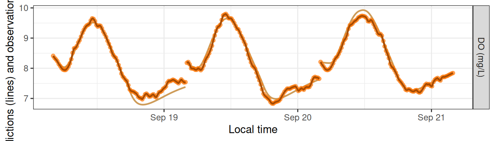
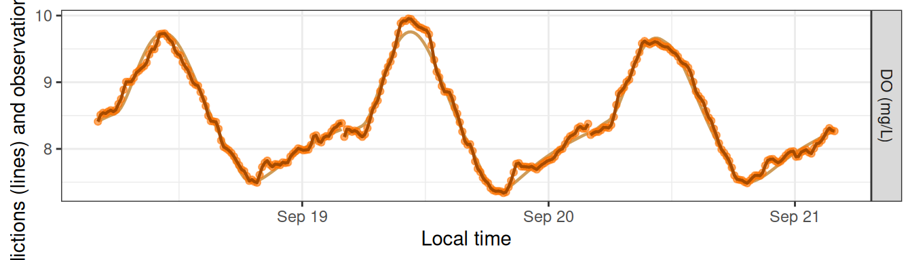
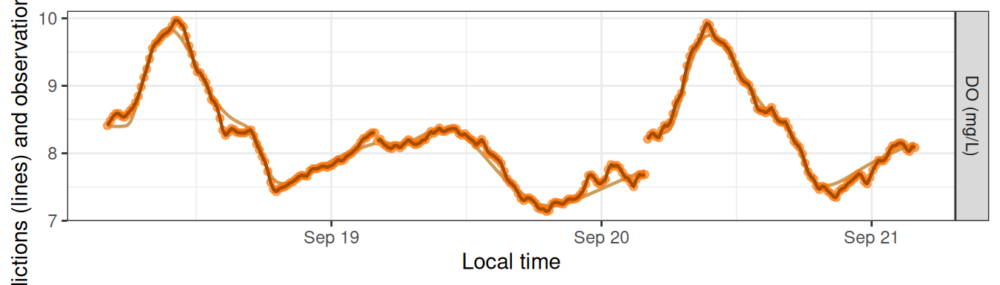
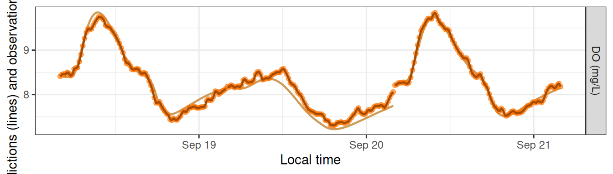
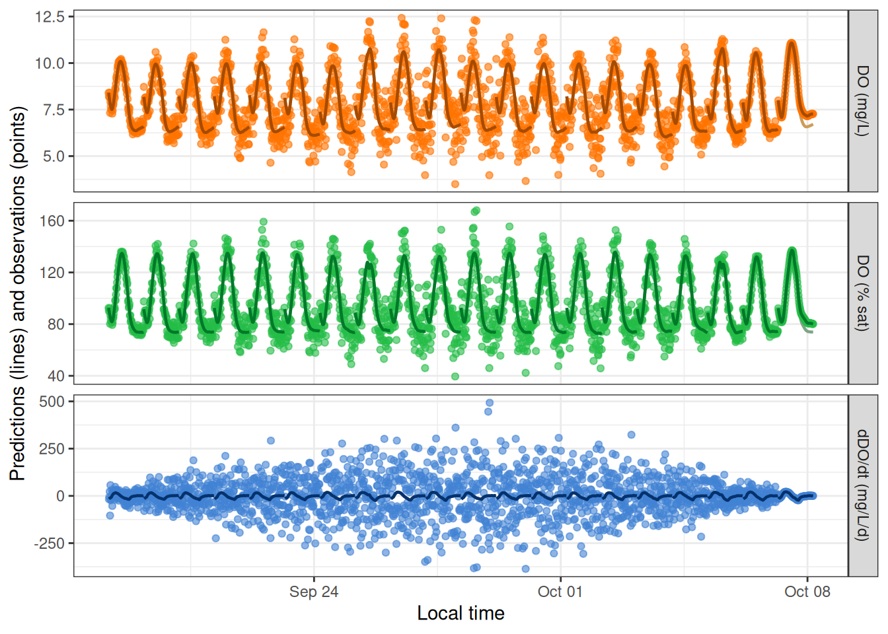
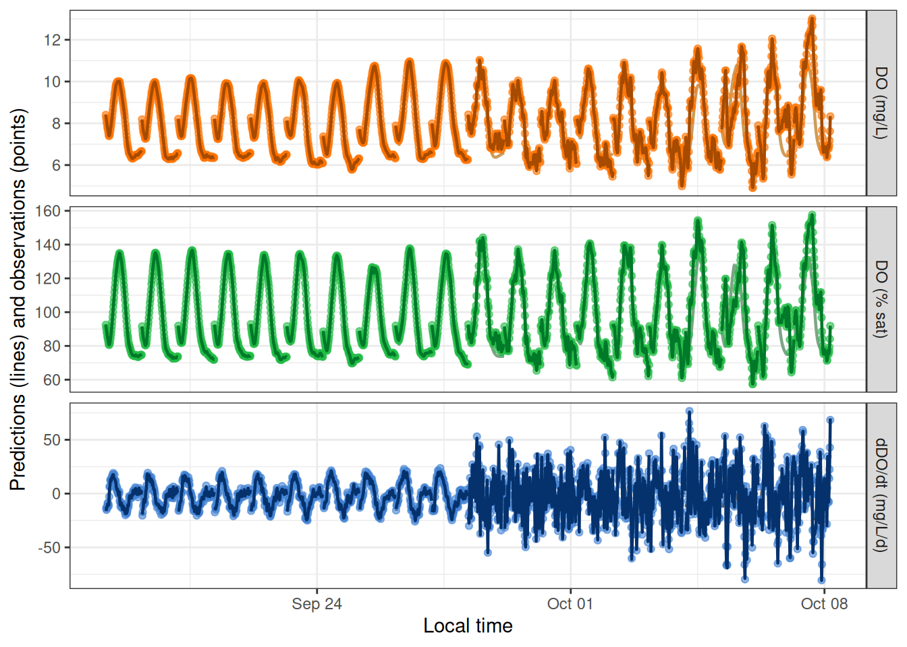

# Simulations

## Overview

This vignette shows how to simulate dissolved oxygen ‘observations’ for
the purpose of exploring and testing metabolism models.

## Setup

Load streamMetabolizer and some helper packages.

``` r

library(streamMetabolizer)
library(dplyr)
library(ggplot2)
```

Get some data to work with: here we’re requesting three days of data at
15-minute resolution. Thanks to Bob Hall for the test data.

``` r

dat <- data_metab('3', '15')
```

## Creating a Sim Model

To create a simulation model, you should

1.  Choose a model structure
2.  Choose daily metabolism parameters
3.  Choose the other model specifications
4.  Create the model
5.  Generate predictions (simulations) from the model

### 1. Choosing the model structure

You can simulate data using any of the GPP and ER functions available to
MLE models. Simulations are done by models of type `'sim'` but otherwise
take very similar arguments to those of an MLE model. Here we’ll use a
model where ER is a function of temperature.

``` r

name_sim_q10 <- mm_name('sim', ER_fun='q10temp')
```

### 2. Choosing the daily parameters

To simulate data, you need to specify the daily parameters beforehand.
The model structure determines which parameters are needed. There are
three good ways to learn which daily parameters you need to specify.

#### A. Trial and error

To learn about parameter needs by trial and error, simply create the
model with the equations you want but without daily inputs, ask for the
parameters, and read the error message to get a list of parameters. It’s
fine to use the defaults for the specifications for now.

``` r

mm_sim_q10_trial <- metab(specs(name_sim_q10), dat)
get_params(mm_sim_q10_trial)
```

    # A tibble: 3 × 9
      date       K600.daily GPP.daily  ER20 err.obs.sigma err.obs.phi err.proc.sigma err.proc.phi
      <date>          <dbl>     <dbl> <dbl>         <dbl>       <dbl>          <dbl>        <dbl>
    1 2012-09-18       4.77    3.96   -15.0          0.01           0            0.2            0
    2 2012-09-19       4.41    5.18   -15.4          0.01           0            0.2            0
    3 2012-09-20       0       0.0114 -14.8          0.01           0            0.2            0
    # ℹ 1 more variable: discharge.daily <dbl>

Great: we need `GPP.daily`, `ER20`, and `K600.daily`. Now we can pick
values for those parameters and put them in a data.frame.

``` r

params_sim_q10a <- data.frame(date=as.Date(paste0('2012-09-',18:20)), GPP.daily=2.1, ER20=-5:-3, K600.daily=16)
params_sim_q10a
```

            date GPP.daily ER20 K600.daily
    1 2012-09-18       2.1   -5         16
    2 2012-09-19       2.1   -4         16
    3 2012-09-20       2.1   -3         16

#### B. Generate parameters from another model

You can also use fitted parameters from another model as your input for
a simulation model. This method could be useful for identifying
realistic parameters and/or exploring why a model fitting process didn’t
work so well.

First fit an MLE model to the same data using the `GPP_fun` and `ER_fun`
you want. It’s fine (again) to use the defaults for the specifications.

``` r

mm_mle_q10 <- metab(specs(mm_name('mle', ER_fun='q10temp')), data=dat)
```

Then ask for the parameters in the right format (without columns for
uncertainty or messages).

``` r

params_sim_q10b <- get_params(mm_mle_q10, uncertainty='none', messages=FALSE)
params_sim_q10b
```

            date GPP.daily      ER20 K600.daily
    1 2012-09-18  2.051333 -2.696135   22.36965
    2 2012-09-19  2.436224 -3.147503   24.27164
    3 2012-09-20  2.090918 -2.370546   22.84253

#### C. Look at `?mm_name`

Try it. We put lots of details in the help file. Check out the
documentation for the `GPP_fun` and `ER_fun` args in particular.

``` r

?mm_name
```

After reading the documentation you’ll create a data.frame of the same
format as in options A or B.

### 3. Choosing the specifications

After choosing parameters, the next step is to choose the rest of the
specifications. The main difference between sim models and other models
is that you can choose values for the probability distributions of the
observation and/or process errors. See
[`?specs`](https://connorb.github.io/streamMetabolizer/reference/specs.md)
for details on the distribution parameters `err_obs_sigma`,
`err_obs_phi`, `err_proc_sigma`, and `err_proc_phi`.

``` r

specs_sim_q10 <- specs(name_sim_q10, err_obs_sigma=0, err_proc_sigma=1, K600_daily=NULL, GPP_daily=NULL, ER20=NULL)
specs_sim_q10
```

    Model specifications:
      model_name        s_np_oipcpi_tr_plrqkm.rnorm
      day_start         4
      day_end           28
      day_tests         full_day, even_timesteps, complete_data, pos_discharge, pos_depth
      required_timestep NA
      discharge_daily   function; see element [['discharge_daily']] for details
      DO_mod_1          NULL
      K600_daily        NULL
      GPP_daily         NULL
      ER20              NULL
      err_obs_sigma     0
      err_obs_phi       0
      err_proc_sigma    1
      err_proc_phi      0
      err_round         NA
      sim_seed          NA                                                               

### 4. Creating a model

Now you can create a simulation model much as you would an MLE or
Bayesian model. We’ll make two models here, one for each of the
parameter sets we created above.

``` r

mm_sim_q10a <- metab(specs_sim_q10, dat, data_daily=params_sim_q10a)
mm_sim_q10b <- metab(specs_sim_q10, dat, data_daily=params_sim_q10b)
```

### 5. Generating predictions

Predictions and simulations are one and the same when your model is of
type `sim`. The output of `predict_DO` for `sim` models includes three
DO concentration columns. `DO.pure` is what the DO concentrations would
be if the GPP, ER, and K600 parameters exactly described what occurred
in the stream. If there’s process error in your model, `DO.mod` will
differ from `DO.pure` in that `DO.mod` also contains the process error
as a fourth driver (on top of GPP, ER, and reaeration) of in-situ DO
concentrations. (`DO.mod` and `DO.pure` are identical if there’s no
process error.) Lastly, `DO.obs` is a simulation of what your sensor
might record; it includes everything in `DO.mod` plus observation error
representing inaccuracies in how the sensor reads or records the DO
concentration. These three variables are plotted as a muted-color line
(`DO.pure`), a bold dark line (`DO.mod`), and brightly colored points
(`DO.obs`). `DO.pure` is mostly hidden behind the others unless the
errors are large.

``` r

head(predict_DO(mm_sim_q10a))
```

    # A tibble: 6 × 9
      date       solar.time          DO.sat depth temp.water light DO.pure DO.mod DO.obs
      <date>     <dttm>               <dbl> <dbl>      <dbl> <dbl>   <dbl>  <dbl>  <dbl>
    1 2012-09-18 2012-09-18 04:05:58   9.08  0.16       3.6      0    8.41   8.41   8.41
    2 2012-09-18 2012-09-18 04:20:58   9.09  0.16       3.56     0    8.33   8.32   8.32
    3 2012-09-18 2012-09-18 04:35:58   9.11  0.16       3.51     0    8.27   8.17   8.17
    4 2012-09-18 2012-09-18 04:50:58   9.11  0.16       3.48     0    8.21   8.09   8.09
    5 2012-09-18 2012-09-18 05:05:58   9.13  0.16       3.42     0    8.16   8.04   8.04
    6 2012-09-18 2012-09-18 05:20:58   9.14  0.16       3.38     0    8.11   8.01   8.01

``` r

head(predict_DO(mm_sim_q10b))
```

    # A tibble: 6 × 9
      date       solar.time          DO.sat depth temp.water light DO.pure DO.mod DO.obs
      <date>     <dttm>               <dbl> <dbl>      <dbl> <dbl>   <dbl>  <dbl>  <dbl>
    1 2012-09-18 2012-09-18 04:05:58   9.08  0.16       3.6      0    8.41   8.41   8.41
    2 2012-09-18 2012-09-18 04:20:58   9.09  0.16       3.56     0    8.43   8.50   8.50
    3 2012-09-18 2012-09-18 04:35:58   9.11  0.16       3.51     0    8.45   8.51   8.51
    4 2012-09-18 2012-09-18 04:50:58   9.11  0.16       3.48     0    8.47   8.47   8.47
    5 2012-09-18 2012-09-18 05:05:58   9.13  0.16       3.42     0    8.49   8.47   8.47
    6 2012-09-18 2012-09-18 05:20:58   9.14  0.16       3.38     0    8.50   8.50   8.50

``` r

plot_DO_preds(mm_sim_q10a, y_var='conc')
```



``` r

plot_DO_preds(mm_sim_q10b, y_var='conc')
```



## Simulating Errors

The main purpose of simulation models is to generate DO ‘observations’
with error, i.e., noise, to see whether other models can recover the
underlying parameters despite the noise.

For this section we’ll use a simulation with GPP as a saturating
function of light. We’ll use method B from above to choose our daily
parameters.

``` r

specs_sim_sat <- specs(mm_name('sim', GPP_fun='satlight'), err_obs_sigma=0, err_proc_sigma=1, K600_daily=NULL, Pmax=NULL, alpha=NULL, ER_daily=NULL)
params_sim_sat <- get_params(metab(specs(mm_name('mle', GPP_fun='satlight')), data=dat), uncertainty='none', messages=FALSE)
```

### Innovative errors

By default, simulations generate new noise each time you request
predictions.

``` r

mm_sim_sat_i <- metab(specs_sim_sat, dat, data_daily=params_sim_sat)
plot_DO_preds(mm_sim_sat_i, y_var='conc')
```



``` r

plot_DO_preds(mm_sim_sat_i, y_var='conc')
```



### Fixed errors

Alternatively, you can revise the value of `sim_seed` to be a number
(any number) and then the simulation produces the same noise each time.

``` r

mm_sim_sat_f <- metab(revise(specs_sim_sat, sim_seed=47), dat, data_daily=params_sim_sat)
plot_DO_preds(mm_sim_sat_f, y_var='conc')
```


``` r

plot_DO_preds(mm_sim_sat_f, y_var='conc')
```


## Inspecting Models

We’ll use a slightly longer dataset here to demonstrate the potential
for random noise at the levels of both the observations (every time you
run
[`predict_DO()`](https://connorb.github.io/streamMetabolizer/reference/predict_DO.md))
and the daily parameters (every time you define `data_daily`).

``` r

dat <- data_metab('10', '30')
params <- data.frame(date=as.Date(paste0('2012-09-',18:27)), Pmax=rnorm(10, 6, 2), alpha=rnorm(10, 0.01, 0.001), ER20=rnorm(10, -4, 2), K600.daily=16)
specs <- specs(mm_name('sim', GPP_fun='satlight', ER_fun='q10temp'), err_obs_sigma=0.2, err_proc_sigma=1, K600_daily=NULL, Pmax=NULL, alpha=NULL, ER20=NULL)
mm <- metab(specs, data=dat, data_daily=params)
```

Sim models print out their parameters with asterisks to denote that the
values are fixed rather than fitted.

``` r

mm
```

    metab_model of type metab_sim
    streamMetabolizer version 0.12.1.9000
    Specifications:
      model_name        s_np_oipcpi_tr_psrqkm.rnorm
      day_start         4
      day_end           28
      day_tests         full_day, even_timesteps, complete_data, pos_discharge, pos_depth
      required_timestep NA
      discharge_daily   function; see element [['discharge_daily']] for details
      DO_mod_1          NULL
      K600_daily        NULL
      Pmax              NULL
      alpha             NULL
      ER20              NULL
      err_obs_sigma     0.2
      err_obs_phi       0
      err_proc_sigma    1
      err_proc_phi      0
      err_round         NA
      sim_seed          NA
    Fitting time: 0.004 secs elapsed
    Parameters (10 dates)(* = fixed value):
             date K600.daily      Pmax        alpha       ER20 err.obs.sigma err.obs.phi err.proc.sigma
    1  2012-09-18        16* 8.499653* 0.010029735* -4.780125*          0.2           0              1
    2  2012-09-19        16* 7.007731* 0.010537178* -4.657027*          0.2           0              1
    3  2012-09-20        16* 3.238979* 0.009774623* -3.654986*          0.2           0              1
    4  2012-09-21        16* 6.647592* 0.011448446* -5.116775*          0.2           0              1
    5  2012-09-22        16* 7.267074* 0.011769600* -3.637974*          0.2           0              1
    6  2012-09-23        16* 7.610239* 0.011205473* -8.047155*          0.2           0              1
    7  2012-09-24        16* 8.687355* 0.008570020* -1.581533*          0.2           0              1
    8  2012-09-25        16* 6.872180* 0.010270915* -5.840345*          0.2           0              1
    9  2012-09-26        16* 5.671489* 0.009372155* -7.103388*          0.2           0              1
    10 2012-09-27        16* 8.824851* 0.011480065* -3.531540*          0.2           0              1
       err.proc.phi discharge.daily msgs.fit
    1            0        16.68038        NA
    2            0        19.22725        NA
    3            0        19.49108        NA
    4            0        21.31775        NA
    5            0        16.67995        NA
    6            0        22.57157        NA
    7            0        18.07964        NA
    8            0        20.17713        NA
    9            0        14.24117        NA
    10           0        20.58617        NA
    Predictions (10 dates):
    # A tibble: 10 × 9
       date         GPP GPP.lower GPP.upper     ER ER.lower ER.upper msgs.fit msgs.pred
       <date>     <dbl> <lgl>     <lgl>      <dbl> <lgl>    <lgl>    <lgl>    <chr>
     1 2012-09-18  3.32 NA        NA        -2.73  NA       NA       NA       "       "
     2 2012-09-19  2.92 NA        NA        -2.71  NA       NA       NA       "       "
     3 2012-09-20  1.50 NA        NA        -2.13  NA       NA       NA       "       "
     4 2012-09-21  2.82 NA        NA        -3.00  NA       NA       NA       "       "
     5 2012-09-22  3.03 NA        NA        -2.12  NA       NA       NA       "       "
     6 2012-09-23  3.09 NA        NA        -4.81  NA       NA       NA       "       "
     7 2012-09-24  3.06 NA        NA        -0.947 NA       NA       NA       "       "
     8 2012-09-25  2.77 NA        NA        -3.19  NA       NA       NA       "       "
     9 2012-09-26  2.33 NA        NA        -3.97  NA       NA       NA       "       "
    10 2012-09-27  3.38 NA        NA        -1.90  NA       NA       NA       "       "

Sim models produce daily estimates of GPP and ER, which should help in
choosing simulation parameters. The GPP and ER predictions have no error
bars because they’re direct calculations from the daily parameters.

``` r

plot_metab_preds(mm)
```


## Multi-Day Simulations

You can also use `sim` models to simulate variation across many days.
Let’s start by generating a 60-day timeseries of water temperature,
DO.sat, etc. by concatenating 6 copies of 10 days of French Creek data:

``` r

dat <- data_metab('10','15')
datlen <- as.numeric(diff(range(dat$solar.time)) + as.difftime(15, units='mins'), units='days')
dat20 <- bind_rows(lapply((0:1)*10, function(add) {
  mutate(dat, solar.time = solar.time + as.difftime(add, units='days'))
}))
```

You can specify a distribution rather than specific values for GPP, ER,
and/or K600 parameters. In fact, this is the default if you don’t
specify daily data:

``` r

sp <- specs(mm_name('sim'))
lapply(unclass(sp)[c('K600_daily','GPP_daily','ER_daily')], function(fun) {
  list(code=attr(fun, 'srcref'), example_vals=fun(n=10))
})
```

    $K600_daily
    $K600_daily$code
    NULL

    $K600_daily$example_vals
     [1] 1.7513931 3.3944354 0.1149945 2.4103963 6.4021173 9.4782605 2.1073986 2.0837559 2.4890243
    [10] 0.0000000


    $GPP_daily
    $GPP_daily$code
    NULL

    $GPP_daily$example_vals
     [1]  3.164087  6.454913  6.218762  3.954867  9.132143  5.346469 14.232066  6.452049  5.326161
    [10] 14.967311


    $ER_daily
    $ER_daily$code
    NULL

    $ER_daily$example_vals
     [1] -16.430518   0.000000 -10.007315  -1.267789 -18.011094  -7.757120  -9.918301 -11.573018
     [9]  -6.189056  -7.915214

These functions get called to generate new values for K600.daily,
GPP.daily, and ER.daily each time you call `get_params`,
`predict_metab`, or `predict_DO`. (They’ll be the same random values
each time if you set `sim_seed`.)

``` r

mm <- metab(sp, dat20, data_daily=NULL)
get_params(mm)[c('date','K600.daily','GPP.daily','ER.daily')]
```

    # A tibble: 20 × 4
       date       K600.daily GPP.daily ER.daily
       <date>          <dbl>     <dbl>    <dbl>
     1 2012-09-18      0.381      4.56   -19.3
     2 2012-09-19      0          4.08    -6.79
     3 2012-09-20      4.33       9.35    -9.17
     4 2012-09-21      6.13      11.1     -1.53
     5 2012-09-22      0          6.27   -13.2
     6 2012-09-23      4.19       2.44    -2.74
     7 2012-09-24      2.60      15.8    -13.6
     8 2012-09-25      2.26      10.8      0
     9 2012-09-26      2.21       6.17   -13.5
    10 2012-09-27      5.78       8.41   -14.1
    11 2012-09-28      0         13.5     -4.47
    12 2012-09-29      7.99      14.0     -8.93
    13 2012-09-30      0.566     14.8    -10.8
    14 2012-10-01      0          0      -11.4
    15 2012-10-02      3.93       7.52   -12.9
    16 2012-10-03      1.98      10.3    -11.5
    17 2012-10-04      0.840      4.64   -11.6
    18 2012-10-05      0.924      7.68   -12.1
    19 2012-10-06      6.73       6.56     0
    20 2012-10-07      0         11.9    -15.7 

You can also set `err_obs_sigma` and other error terms as daily values
and/or functions. The defaults are simple numeric values that get
replicated to every date, but the values can also be vectors or
functions, as with `GPP_daily`, etc.

``` r

sp <- specs('sim', err_obs_sigma=function(n, ...) -0.01*((1:n) - (n/2))^2 + 1, err_proc_sigma=function(n, ...) rnorm(n, 0.1, 0.005), err_proc_phi=seq(0, 1, length.out=20), GPP_daily=3, ER_daily=-4, K600_daily=16)
mm <- metab(sp, dat20)
get_params(mm)
```

    # A tibble: 20 × 9
       date       K600.daily GPP.daily ER.daily err.obs.sigma err.obs.phi err.proc.sigma err.proc.phi
       <date>          <dbl>     <dbl>    <dbl>         <dbl>       <dbl>          <dbl>        <dbl>
     1 2012-09-18         16         3       -4          0.19           0         0.101        0
     2 2012-09-19         16         3       -4          0.36           0         0.104        0.0526
     3 2012-09-20         16         3       -4          0.51           0         0.0962       0.105
     4 2012-09-21         16         3       -4          0.64           0         0.0950       0.158
     5 2012-09-22         16         3       -4          0.75           0         0.108        0.211
     6 2012-09-23         16         3       -4          0.84           0         0.0984       0.263
     7 2012-09-24         16         3       -4          0.91           0         0.100        0.316
     8 2012-09-25         16         3       -4          0.96           0         0.0962       0.368
     9 2012-09-26         16         3       -4          0.99           0         0.0901       0.421
    10 2012-09-27         16         3       -4          1              0         0.117        0.474
    11 2012-09-28         16         3       -4          0.99           0         0.0963       0.526
    12 2012-09-29         16         3       -4          0.96           0         0.0996       0.579
    13 2012-09-30         16         3       -4          0.91           0         0.100        0.632
    14 2012-10-01         16         3       -4          0.84           0         0.0994       0.684
    15 2012-10-02         16         3       -4          0.75           0         0.106        0.737
    16 2012-10-03         16         3       -4          0.64           0         0.106        0.789
    17 2012-10-04         16         3       -4          0.51           0         0.0994       0.842
    18 2012-10-05         16         3       -4          0.36           0         0.104        0.895
    19 2012-10-06         16         3       -4          0.19           0         0.106        0.947
    20 2012-10-07         16         3       -4          0              0         0.102        1
    # ℹ 1 more variable: discharge.daily <dbl>

``` r

plot_DO_preds(mm)
```



The above simulation emphasized day-to-day variation in `err_obs_sigma`.
Here’s a simulation emphasizing variation in `err_proc_sigma` and
`err_proc_phi`:

``` r

sp <- specs('sim', err_obs_sigma=0.01, err_proc_sigma=function(n, ...) rep(c(0.5, 4), each=10), err_proc_phi=rep(seq(0, 0.8, length.out=10), times=2), GPP_daily=3, ER_daily=-4, K600_daily=16)
mm <- metab(sp, dat20)
get_params(mm)
```

    # A tibble: 20 × 9
       date       K600.daily GPP.daily ER.daily err.obs.sigma err.obs.phi err.proc.sigma err.proc.phi
       <date>          <dbl>     <dbl>    <dbl>         <dbl>       <dbl>          <dbl>        <dbl>
     1 2012-09-18         16         3       -4          0.01           0            0.5       0
     2 2012-09-19         16         3       -4          0.01           0            0.5       0.0889
     3 2012-09-20         16         3       -4          0.01           0            0.5       0.178
     4 2012-09-21         16         3       -4          0.01           0            0.5       0.267
     5 2012-09-22         16         3       -4          0.01           0            0.5       0.356
     6 2012-09-23         16         3       -4          0.01           0            0.5       0.444
     7 2012-09-24         16         3       -4          0.01           0            0.5       0.533
     8 2012-09-25         16         3       -4          0.01           0            0.5       0.622
     9 2012-09-26         16         3       -4          0.01           0            0.5       0.711
    10 2012-09-27         16         3       -4          0.01           0            0.5       0.8
    11 2012-09-28         16         3       -4          0.01           0            4         0
    12 2012-09-29         16         3       -4          0.01           0            4         0.0889
    13 2012-09-30         16         3       -4          0.01           0            4         0.178
    14 2012-10-01         16         3       -4          0.01           0            4         0.267
    15 2012-10-02         16         3       -4          0.01           0            4         0.356
    16 2012-10-03         16         3       -4          0.01           0            4         0.444
    17 2012-10-04         16         3       -4          0.01           0            4         0.533
    18 2012-10-05         16         3       -4          0.01           0            4         0.622
    19 2012-10-06         16         3       -4          0.01           0            4         0.711
    20 2012-10-07         16         3       -4          0.01           0            4         0.8
    # ℹ 1 more variable: discharge.daily <dbl>

``` r

plot_DO_preds(mm)
```



The daily parameter functions that you assign in
[`specs()`](https://connorb.github.io/streamMetabolizer/reference/specs.md)
can refer to previous daily parameters in the list. For example,
ER_daily can be a function of `GPP.daily`. Values of `GPP.daily` may
have been specified in the `GPP.daily` column of `data_daily` or in the
`GPP_daily` argument to
[`specs()`](https://connorb.github.io/streamMetabolizer/reference/specs.md);
the ER function should refer to it with its period-separated name,
`GPP.daily`.

``` r

sp <- specs('sim', err_obs_sigma=0.01, err_proc_sigma=0.4, K600_daily=16, GPP_daily=function(n, ...) round(rnorm(n, 4, 1), 1), ER_daily=function(GPP.daily, ...) GPP.daily*-2)
mm <- metab(sp, dat20)
get_params(mm)
```

    # A tibble: 20 × 9
       date       K600.daily GPP.daily ER.daily err.obs.sigma err.obs.phi err.proc.sigma err.proc.phi
       <date>          <dbl>     <dbl>    <dbl>         <dbl>       <dbl>          <dbl>        <dbl>
     1 2012-09-18         16       3.9     -7.8          0.01           0            0.4            0
     2 2012-09-19         16       3.4     -6.8          0.01           0            0.4            0
     3 2012-09-20         16       4.7     -9.4          0.01           0            0.4            0
     4 2012-09-21         16       5.1    -10.2          0.01           0            0.4            0
     5 2012-09-22         16       3.1     -6.2          0.01           0            0.4            0
     6 2012-09-23         16       5.4    -10.8          0.01           0            0.4            0
     7 2012-09-24         16       6.4    -12.8          0.01           0            0.4            0
     8 2012-09-25         16       3.4     -6.8          0.01           0            0.4            0
     9 2012-09-26         16       5      -10            0.01           0            0.4            0
    10 2012-09-27         16       2.1     -4.2          0.01           0            0.4            0
    11 2012-09-28         16       4.3     -8.6          0.01           0            0.4            0
    12 2012-09-29         16       3.4     -6.8          0.01           0            0.4            0
    13 2012-09-30         16       4       -8            0.01           0            0.4            0
    14 2012-10-01         16       5.2    -10.4          0.01           0            0.4            0
    15 2012-10-02         16       3.2     -6.4          0.01           0            0.4            0
    16 2012-10-03         16       4.8     -9.6          0.01           0            0.4            0
    17 2012-10-04         16       4.2     -8.4          0.01           0            0.4            0
    18 2012-10-05         16       4       -8            0.01           0            0.4            0
    19 2012-10-06         16       3       -6            0.01           0            0.4            0
    20 2012-10-07         16       3.9     -7.8          0.01           0            0.4            0
    # ℹ 1 more variable: discharge.daily <dbl>

The K600_daily function can also take advantage of pre-specified model
structures relating K to discharge. As of December 2016, the `Kb`
formulation (`pool_K600 = 'binned'`) is the only one available. But it’s
a good one! See which parameters you can set by calling `specs` one
preliminary time with a Kb model name:

``` r

sp <- specs(mm_name('sim', pool_K600='binned', ER_fun='q10temp'), sim_seed=6332)
```

The new and relevant arguments are `K600_lnQ_nodes_centers`,
`K600_lnQ_cnode_meanlog`, `K600_lnQ_cnode_sdlog`,
`K600_lnQ_nodediffs_meanlog`, `K600_lnQ_nodediffs_sdlog`, and
`lnK600_lnQ_nodes`. The defaults might work just fine for you, and
changing `lnK600_lnQ_nodes` is especially non-recommended. It’s probably
useful to dial down the noise relating K600.daily to lnK600_lnQ_nodes:

``` r

mm <- metab(revise(sp, K600_daily=function(n, K600_daily_predlog, ...) pmax(0, rnorm(n, exp(K600_daily_predlog), 0.4))), dat20)
pars <- get_params(mm)
pars
```

    # A tibble: 20 × 9
       date       discharge.daily K600.daily GPP.daily   ER20 err.obs.sigma err.obs.phi err.proc.sigma
       <date>               <dbl>      <dbl>     <dbl>  <dbl>         <dbl>       <dbl>          <dbl>
     1 2012-09-18            18.0       3.28     10.9   -4.84          0.01           0            0.2
     2 2012-09-19            19.7       4.26      4.28  -4.60          0.01           0            0.2
     3 2012-09-20            24.1       6.66      4.87  -5.06          0.01           0            0.2
     4 2012-09-21            19.2       3.00     10.7   -6.47          0.01           0            0.2
     5 2012-09-22            21.8       5.49      3.22  -7.69          0.01           0            0.2
     6 2012-09-23            18.7       3.10      9.41 -12.4           0.01           0            0.2
     7 2012-09-24            21.7       5.63      7.83 -13.3           0.01           0            0.2
     8 2012-09-25            23.3       4.91     12.9   -5.81          0.01           0            0.2
     9 2012-09-26            18.2       3.14      1.36 -10.2           0.01           0            0.2
    10 2012-09-27            22.8       5.70      4.16  -7.72          0.01           0            0.2
    11 2012-09-28            19.6       3.96      8.88  -6.51          0.01           0            0.2
    12 2012-09-29            20.5       4.01     10.6   -4.92          0.01           0            0.2
    13 2012-09-30            17.6       2.38      1.28  -7.58          0.01           0            0.2
    14 2012-10-01            23.6       6.08      6.48 -12.6           0.01           0            0.2
    15 2012-10-02            20.7       4.14      4.47 -10.5           0.01           0            0.2
    16 2012-10-03            22.5       5.35      9.71 -15.3           0.01           0            0.2
    17 2012-10-04            24.3       6.65      3.10  -5.42          0.01           0            0.2
    18 2012-10-05            20.6       4.46      1.19  -8.08          0.01           0            0.2
    19 2012-10-06            22.1       5.64      9.03  -9.68          0.01           0            0.2
    20 2012-10-07            23.8       6.17      7.36  -8.96          0.01           0            0.2
    # ℹ 1 more variable: err.proc.phi <dbl>

In this model, even the K~Q relationship is simulated on each call to
`get_params`, `predict_metab`, or `predict_DO`. You can inspect the
relationship by looking at the `K600_eqn` attribute to the output of
`get_params`:

``` r

attr(pars, 'K600_eqn')
```

    $K600_lnQ_nodes_centers
    [1] 2.7 2.9 3.1 3.3

    $K600_lnQ_cnode_meanlog
     [1] 1.791759 1.791759 1.791759 1.791759 1.791759 1.791759 1.791759 1.791759 1.791759 1.791759
    [11] 1.791759 1.791759 1.791759 1.791759 1.791759 1.791759 1.791759 1.791759 1.791759 1.791759

    $K600_lnQ_cnode_sdlog
     [1] 1 1 1 1 1 1 1 1 1 1 1 1 1 1 1 1 1 1 1 1

    $K600_lnQ_nodediffs_meanlog
     [1] 0.2 0.2 0.2 0.2 0.2 0.2 0.2 0.2 0.2 0.2 0.2 0.2 0.2 0.2 0.2 0.2 0.2 0.2 0.2 0.2

    $K600_lnQ_nodediffs_sdlog
     [1] 0.5 0.5 0.5 0.5 0.5 0.5 0.5 0.5 0.5 0.5 0.5 0.5 0.5 0.5 0.5 0.5 0.5 0.5 0.5 0.5

    $lnK600_lnQ_nodes
    [1] 0.4988654 1.1196713 1.7336039 1.9001201

    $K600_daily_predlog
     [1] 1.081589 1.374665 1.802429 1.294170 1.682755 1.201935 1.659220 1.773209 1.121921 1.754740
    [11] 1.345448 1.489414 1.013952 1.784239 1.514669 1.743331 1.809455 1.503737 1.719929 1.793327

The centers and nodes are the essential pieces of the final piecewise
relationship (blue points and line). We can also identify the
predictions for specific dates and discharges along that line (purple
points) and the K600 params that result from adding noise to those
predictions (red points):

``` r

KQ <- as.data.frame(attr(pars, 'K600_eqn')[c('K600_lnQ_nodes_centers', 'lnK600_lnQ_nodes')])
Kpred <- mutate(select(pars, date, discharge.daily, K600.daily), K600_daily_predlog=attr(pars, 'K600_eqn')$K600_daily_predlog)
ggplot(KQ, aes(x=K600_lnQ_nodes_centers, y=lnK600_lnQ_nodes)) + geom_line(color='blue') + geom_point(color='blue') +
  geom_point(data=Kpred, aes(x=log(discharge.daily), y=K600_daily_predlog), color='purple') +
  geom_point(data=Kpred, aes(x=log(discharge.daily), y=log(K600.daily)), color='red')
```


\`\`\`
