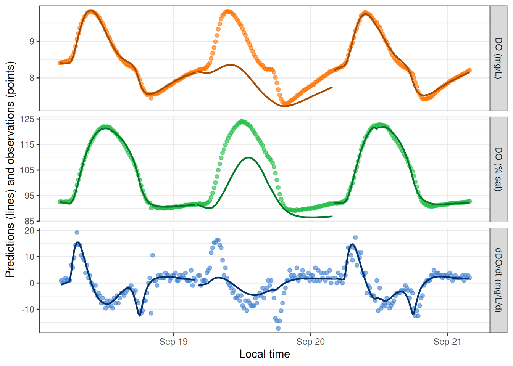
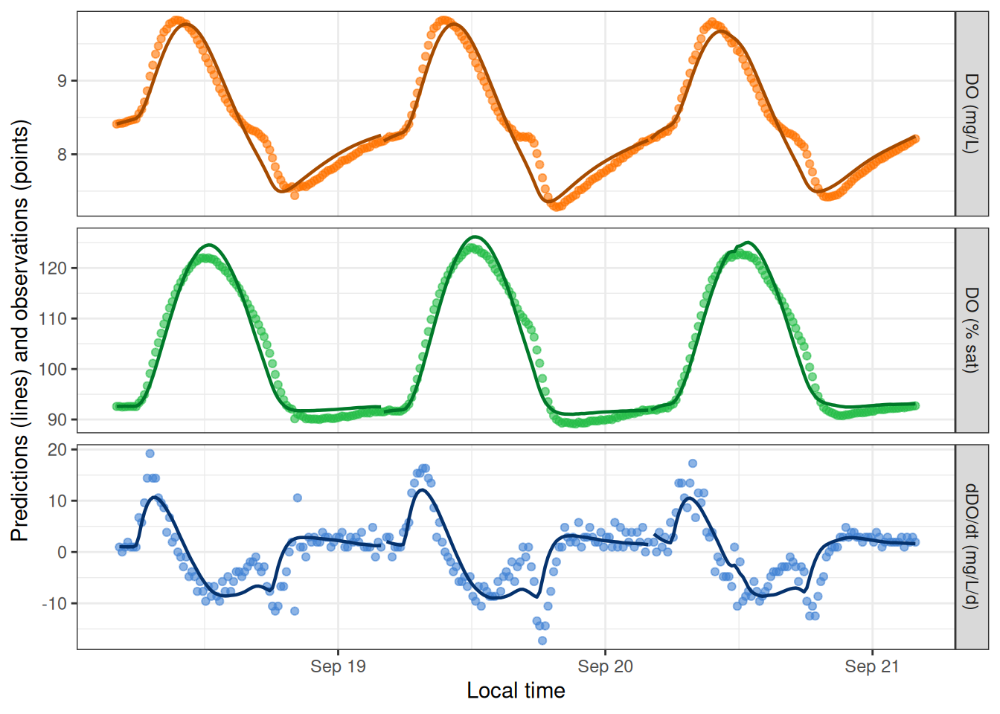
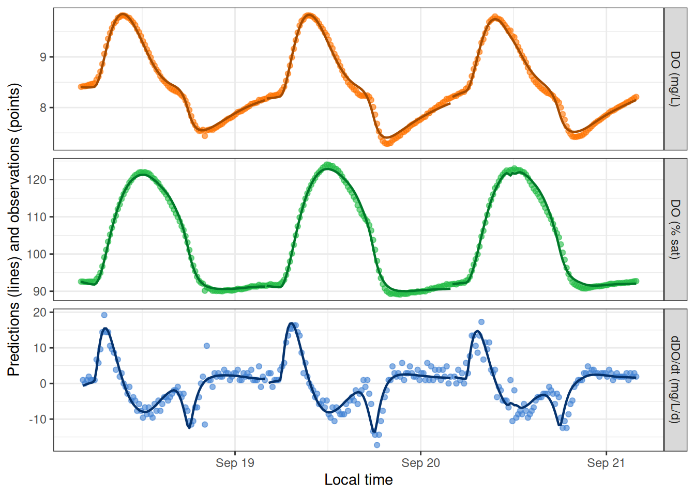

# GPP and ER Equations

## Overview

This vignette demonstrates a few of the options for relating GPP and ER
to light and/or temperature.

## Setup

Load streamMetabolizer and dplyr.

``` r

library(streamMetabolizer)
library(dplyr)
```

Get some data to work with: here we’re requesting three days of data at
15-minute resolution. Thanks to Bob Hall for the test data.

``` r

dat <- data_metab('3', '15')
```

## GPP and ER functions

Here’s a basic model with GPP proportional to light and ER constant over
time.

``` r

# the Classic: linear GPP, constant ER (also the default)
mm_classic <-
  mm_name('mle', GPP_fun='linlight', ER_fun='constant') |>
  specs() |>
  metab(dat)
mm_classic
```

    metab_model of type metab_mle
    streamMetabolizer version 0.12.1.9000
    Specifications:
      model_name        m_np_oi_tr_plrckm.nlm
      day_start         4
      day_end           28
      day_tests         full_day, even_timesteps, complete_data, pos_discharge, pos_depth
      required_timestep NA
      init.GPP.daily    8
      init.ER.daily     -10
      init.K600.daily   10
    Fitting time: 0.422 secs elapsed
    Parameters (3 dates):
            date GPP.daily GPP.daily.lower GPP.daily.upper   ER.daily ER.daily.lower ER.daily.upper
    1 2012-09-18 2.814873         2.158411        3.471335 -2.113937       -2.647969      -1.579906
    2 2012-09-19 3.271209         2.561176        3.981243 -2.466198       -3.052360      -1.880037
    3 2012-09-20 2.590927         2.119941        3.061914 -1.712055       -2.070765      -1.353344
      K600.daily K600.daily.lower K600.daily.upper msgs.fit
    1  31.06049          24.47002         37.65096
    2  33.23838          26.62471         39.85206
    3  28.71846          24.00835         33.42857
    Predictions (3 dates):
    # A tibble: 3 × 9
      date         GPP GPP.lower GPP.upper    ER ER.lower ER.upper msgs.fit  msgs.pred
      <date>     <dbl>     <dbl>     <dbl> <dbl>    <dbl>    <dbl> <chr>     <chr>
    1 2012-09-18  2.81      2.16      3.47 -2.11    -2.65    -1.58 "       " "       "
    2 2012-09-19  3.27      2.56      3.98 -2.47    -3.05    -1.88 "       " "       "
    3 2012-09-20  2.59      2.12      3.06 -1.71    -2.07    -1.35 "       " "       "

Here’s one where GPP is a saturating function of light. ER is still
constant.

``` r

# the Saturator: GPP saturating with light, constant ER
mm_saturator <-
  mm_name('mle', GPP_fun='satlight', ER_fun='constant') |>
  specs() |>
  metab(dat)
mm_saturator
```

    metab_model of type metab_mle
    streamMetabolizer version 0.12.1.9000
    Specifications:
      model_name        m_np_oi_tr_psrckm.nlm
      day_start         4
      day_end           28
      day_tests         full_day, even_timesteps, complete_data, pos_discharge, pos_depth
      required_timestep NA
      init.Pmax         10
      init.alpha        1e-04
      init.ER.daily     -10
      init.K600.daily   10
    Fitting time: 1.447 secs elapsed
    Parameters (3 dates):
            date       Pmax Pmax.lower Pmax.upper         alpha  alpha.lower alpha.upper    ER.daily
    1 2012-09-18  6.033049    5.715948   6.350149 0.0083268781  0.0078854775 0.008768279 -1.9344527
    2 2012-09-19 10.636301  -14.149356  35.421959 0.0006899063  0.0001361327 0.001243680 -0.9308165
    3 2012-09-20  6.226685    5.745419   6.707950 0.0073752921  0.0068235252 0.007927059 -1.6730454
      ER.daily.lower ER.daily.upper K600.daily K600.daily.lower K600.daily.upper msgs.fit
    1      -2.025453     -1.8434520 24.570655         23.556080         25.58523
    2      -1.247575     -0.6140585  9.018137          6.705663         11.33061      W
    3      -1.789892     -1.5561989 24.400665         23.003057         25.79827
    Fitting warnings:
      1 date: iteration limit exceeded
    Predictions (3 dates):
    # A tibble: 3 × 9
      date         GPP GPP.lower GPP.upper     ER ER.lower ER.upper msgs.fit  msgs.pred
      <date>     <dbl> <lgl>     <lgl>      <dbl>    <dbl>    <dbl> <chr>     <chr>
    1 2012-09-18 2.47  NA        NA        -1.93     -2.03   -1.84  "       " "       "
    2 2012-09-19 0.392 NA        NA        -0.931    -1.25   -0.614 "    W  " "       "
    3 2012-09-20 2.41  NA        NA        -1.67     -1.79   -1.56  "       " "       "

The Saturator produces fitting warnings, which are condensed to ‘w’ and
a summary in the above print-out. They can be inspected in detail by
looking directly at the fitted daily parameters:

``` r

get_params(mm_saturator) |> select(date, warnings, errors)
```

            date                 warnings errors
    1 2012-09-18
    2 2012-09-19 iteration limit exceeded
    3 2012-09-20                                

Similary, you can inspect the warnings and errors that arise during
prediction by pulling out the daily metabolism predictions (but there
aren’t any, so those columns are empty):

``` r

predict_metab(mm_saturator) |> select(date, warnings, errors)
```

    # A tibble: 3 × 3
      date       warnings errors
      <date>     <chr>    <chr>
    1 2012-09-18 ""       ""
    2 2012-09-19 ""       ""
    3 2012-09-20 ""       ""    

You can predict and/or plot instantaneous DO values from the fitted
daily parameters.

``` r

predict_DO(mm_saturator) |> head()
```

    # A tibble: 6 × 8
      date       solar.time          DO.obs DO.sat depth temp.water light DO.mod
      <date>     <dttm>               <dbl>  <dbl> <dbl>      <dbl> <dbl>  <dbl>
    1 2012-09-18 2012-09-18 04:05:58   8.41   9.08  0.16       3.6      0   8.41
    2 2012-09-18 2012-09-18 04:20:58   8.42   9.09  0.16       3.56     0   8.40
    3 2012-09-18 2012-09-18 04:35:58   8.42   9.11  0.16       3.51     0   8.40
    4 2012-09-18 2012-09-18 04:50:58   8.43   9.11  0.16       3.48     0   8.40
    5 2012-09-18 2012-09-18 05:05:58   8.45   9.13  0.16       3.42     0   8.40
    6 2012-09-18 2012-09-18 05:20:58   8.46   9.14  0.16       3.38     0   8.40

``` r

plot_DO_preds(mm_saturator)
```



Yep, that fitting warning on day 2 was meaningful! We can encourage the
model toward a good fit by adjusting the initial values of Pmax and
alpha from which the fitting function should explore likelihood space.
There are two ways to do this - as date-specific values in data_daily,
or as values that apply to every date in specs(). The two methods can
even be combined.

``` r

mm_saturator2 <-
  mm_name('mle', GPP_fun='satlight', ER_fun='constant') |>
  specs() |>
  metab(dat, data_daily=select(get_params(mm_saturator), date, init.Pmax=Pmax, init.alpha=alpha))
get_params(mm_saturator2)
```

            date     Pmax   Pmax.sd       alpha     alpha.sd  ER.daily ER.daily.sd K600.daily
    1 2012-09-18 6.033048 0.1614450 0.008326878 0.0002252292 -1.934453  0.04636854   24.57065
    2 2012-09-19 7.269962 0.2810137 0.009041367 0.0003329972 -2.239060  0.07722047   26.60996
    3 2012-09-20 6.226683 0.2451116 0.007375290 0.0002815439 -1.673045  0.05956598   24.40066
      K600.daily.sd
    1     0.5166937
    2     0.7961691
    3     0.7120838
                                                                                                                                                    warnings
    1
    2
    3 last global step failed to locate a point lower than estimate. Either estimate is an approximate local minimum of the function or steptol is too small
      errors
    1
    2
    3       

``` r

mm_saturator3 <-
  mm_name('mle', GPP_fun='satlight', ER_fun='constant') |>
  specs(init.Pmax=6.2, init.alpha=0.008) |>
  metab(dat)
get_params(mm_saturator3)
```

            date     Pmax   Pmax.sd       alpha     alpha.sd  ER.daily ER.daily.sd K600.daily
    1 2012-09-18 6.033048 0.1614592 0.008326878 0.0002252284 -1.934452  0.04637106   24.57065
    2 2012-09-19 7.270001 0.2806162 0.009041332 0.0003330177 -2.239060  0.07715525   26.61006
    3 2012-09-20 6.226684 0.2451105 0.007375292 0.0002815623 -1.673045  0.05956607   24.40066
      K600.daily.sd
    1     0.5167332
    2     0.7952315
    3     0.7120806
                                                                                                                                                    warnings
    1 last global step failed to locate a point lower than estimate. Either estimate is an approximate local minimum of the function or steptol is too small
    2
    3
      errors
    1
    2
    3       

``` r

mm_saturator4 <-
  mm_name('mle', GPP_fun='satlight', ER_fun='constant') |>
  specs(init.Pmax=6.2, init.alpha=0.008) |>
  metab(dat, transmute(get_params(mm_saturator), date, init.Pmax=Pmax[1], init.alpha=alpha[1])[2,])
get_params(mm_saturator4)
```

            date     Pmax   Pmax.sd       alpha     alpha.sd  ER.daily ER.daily.sd K600.daily
    1 2012-09-18 6.033048 0.1614592 0.008326878 0.0002252284 -1.934452  0.04637106   24.57065
    2 2012-09-19 7.270001 0.2806151 0.009041378 0.0003330192 -2.239069  0.07715563   26.61007
    3 2012-09-20 6.226684 0.2451105 0.007375292 0.0002815623 -1.673045  0.05956607   24.40066
      K600.daily.sd
    1     0.5167332
    2     0.7952308
    3     0.7120806
                                                                                                                                                                                                                                       warnings
    1 data_daily$init.Pmax==NA so using specs; data_daily$init.alpha==NA so using specs; last global step failed to locate a point lower than estimate. Either estimate is an approximate local minimum of the function or steptol is too small
    2
    3                                                                                                                                                         data_daily$init.Pmax==NA so using specs; data_daily$init.alpha==NA so using specs
      errors
    1
    2
    3       

Despite the remaining warnings, DO predictions from the saturating
GPP-light function do look better than from the classic model for this
particular dataset.

``` r

plot_DO_preds(mm_classic)
```



``` r

plot_DO_preds(mm_saturator4)
```



See the full list of available functions for gross primary productivity
(GPP) and ecosystem respiration (ER) in
[`?mm_name`](https://connorb.github.io/streamMetabolizer/dev/reference/mm_name.md).
